# Kamil Edu - School Management System (SaaS)
## Complete Technical Documentation

**Version:** 1.0.0+17
**Framework:** Flutter (Dart SDK ^3.9.0)
**Platforms:** iOS, Android, macOS, Web
**Architecture:** Feature-based with Provider/Riverpod State Management
**Design System:** Kamil Edu Professional Design System v2.16
**Last Updated:** 2026-03-26

---

## Table of Contents

1. [System Overview](#1-system-overview)
2. [Architecture & Design Patterns](#2-architecture--design-patterns)
3. [Data Models & Schema](#3-data-models--schema)
4. [Entity Relationship Diagram (ERD)](#4-entity-relationship-diagram-erd)
5. [Authentication & Authorization Flow](#5-authentication--authorization-flow)
6. [Role-Based Access Control (RBAC)](#6-role-based-access-control-rbac)
7. [API Service Layer & Endpoints](#7-api-service-layer--endpoints)
8. [Screen Flow & Navigation](#8-screen-flow--navigation)
9. [State Management](#9-state-management)
10. [AI-Powered Features](#10-ai-powered-features)
11. [Feature Modules (Detailed)](#11-feature-modules-detailed)
12. [Caching Strategy](#12-caching-strategy)
13. [Error Handling Architecture](#13-error-handling-architecture)
14. [Push Notifications (FCM)](#14-push-notifications-fcm)
15. [Export System (PDF & Excel)](#15-export-system-pdf--excel)
16. [Localization & Internationalization](#16-localization--internationalization)
17. [Design System Reference](#17-design-system-reference)
18. [Testing Strategy](#18-testing-strategy)
19. [Dependency Map](#19-dependency-map)
20. [Deployment & Build Configuration](#20-deployment--build-configuration)

---

## 1. System Overview

### 1.1 What is Kamil Edu?

Kamil Edu is a comprehensive **SaaS School Management System** built with Flutter for cross-platform deployment. It serves as a complete digital solution for Indonesian K-12 schools, enabling administrators, teachers, and parents to manage academic operations seamlessly.

The system integrates **AI-powered features** including automatic lesson plan generation (using OpenAI GPT-3.5-turbo) and personalized teaching recommendations (using KamillLabs Edu AI microservice), making it a next-generation educational platform.

### 1.2 Key Capabilities

- **Multi-School SaaS** — A single user can belong to multiple schools; school switching is built into the auth flow
- **Multi-Role System** — Users can hold different roles (Admin, Teacher/Guru, Parent/Wali, Staff) across schools
- **AI Integration** — Automatic RPP (lesson plan) generation and personalized teaching recommendations
- **Real-Time Notifications** — Firebase Cloud Messaging for push notifications
- **Comprehensive Data Export** — PDF and Excel export for attendance, grades, report cards, and more
- **Bilingual Support** — English and Indonesian (Bahasa Indonesia)
- **Offline-Ready Caching** — Two-tier caching with TTL for API responses

### 1.3 High-Level System Architecture

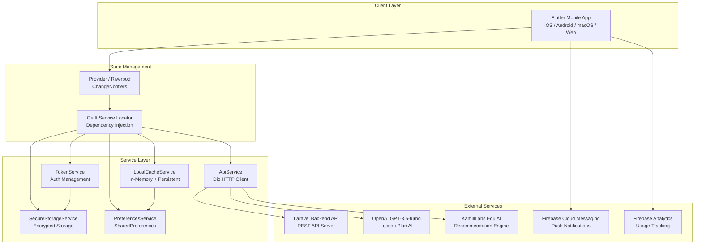

### 1.4 Directory Structure

```
kamiledu-mobile-flutter/
├── lib/
│   ├── main.dart                          # Entry point & initialization
│   ├── core/
│   │   ├── constants/
│   │   │   ├── api_endpoints.dart         # All API route constants
│   │   │   └── app_spacing.dart           # 4px grid spacing constants
│   │   ├── di/
│   │   │   └── service_locator.dart       # GetIt dependency injection
│   │   ├── models/
│   │   │   ├── user.dart                  # User model
│   │   │   ├── student.dart               # Student model (Freezed)
│   │   │   ├── teacher.dart               # Teacher model
│   │   │   ├── classroom.dart             # Classroom model
│   │   │   ├── grade.dart                 # Grade model
│   │   │   ├── attendance.dart            # Attendance model
│   │   │   ├── announcement.dart          # Announcement model
│   │   │   ├── activity.dart              # Activity model
│   │   │   ├── attendance_summary.dart    # Attendance summary (Freezed)
│   │   │   └── pagination_model.dart      # Pagination wrapper
│   │   ├── network/
│   │   │   ├── dio_client.dart            # Dio HTTP client setup
│   │   │   └── api_exceptions.dart        # Custom exceptions
│   │   ├── providers/
│   │   │   ├── academic_year_provider.dart
│   │   │   ├── teacher_provider.dart
│   │   │   └── riverpod_providers.dart
│   │   ├── router/
│   │   │   ├── app_router.dart            # GoRouter configuration
│   │   │   └── app_navigator.dart         # Navigation helpers
│   │   ├── services/
│   │   │   ├── api_service.dart           # Central HTTP gateway (500+ lines)
│   │   │   ├── token_service.dart         # JWT/Sanctum token management
│   │   │   ├── preferences_service.dart   # SharedPreferences wrapper
│   │   │   ├── secure_storage_service.dart
│   │   │   ├── cache_service.dart         # Local cache with TTL
│   │   │   ├── fcm_service.dart           # Firebase Cloud Messaging
│   │   │   ├── analytics_service.dart     # Firebase Analytics
│   │   │   ├── log_service.dart           # Remote error logging
│   │   │   ├── performance_service.dart   # Firebase Performance
│   │   │   ├── app_logger.dart            # Debug logger
│   │   │   └── tour_service.dart          # Tutorial/onboarding
│   │   ├── utils/
│   │   │   ├── color_utils.dart           # Design system colors (450+ lines)
│   │   │   ├── dashboard_typography.dart  # Typography system
│   │   │   ├── date_utils.dart            # Date formatting
│   │   │   ├── currency_formatter.dart    # IDR currency formatting
│   │   │   ├── language_utils.dart        # i18n/l10n utilities
│   │   │   ├── error_utils.dart           # Error message parsing
│   │   │   ├── snackbar_utils.dart        # Toast/snackbar helpers
│   │   │   └── cache_key_builder.dart     # Cache key generation
│   │   └── widgets/                       # Shared UI components
│   │       ├── dashboard_card.dart
│   │       ├── gradient_page_header.dart
│   │       ├── enhanced_search_bar.dart
│   │       ├── pagination_widget.dart
│   │       ├── skeleton_loading.dart
│   │       ├── error_screen.dart
│   │       ├── error_handler.dart
│   │       ├── loading_screen.dart
│   │       ├── empty_state.dart
│   │       ├── confirmation_dialog.dart
│   │       └── ...
│   └── features/
│       ├── auth/                          # Authentication
│       ├── dashboard/                     # Role-specific dashboards
│       ├── students/                      # Student management
│       ├── teachers/                      # Teacher management
│       ├── classrooms/                    # Classroom management
│       ├── subjects/                      # Subject management
│       ├── schedule/                      # Schedule/timetable
│       ├── attendance/                    # Attendance tracking
│       ├── grades/                        # Grade management
│       ├── lesson_plans/                  # RPP + AI generation
│       ├── materials/                     # Learning materials
│       ├── recommendations/              # AI recommendations
│       ├── announcements/                # School announcements
│       ├── class_activity/               # Class activities
│       ├── report_cards/                 # Report cards (Raport)
│       ├── finance/                      # Billing & finance
│       ├── notifications/                # In-app notifications
│       ├── settings/                     # App & school settings
│       └── staff/                        # Staff management
├── test/                                 # Unit & widget tests
├── pubspec.yaml                          # Dependencies
├── DESIGN_SYSTEM.md                      # Design guidelines
└── CLAUDE.md                             # AI assistant instructions
```

---

## 2. Architecture & Design Patterns

### 2.1 Overall Architecture Pattern

The application follows a **Feature-Based Architecture** where each feature module is self-contained with its own screens, services, widgets, and export logic. Cross-cutting concerns (auth, caching, networking) live in the `core/` directory.

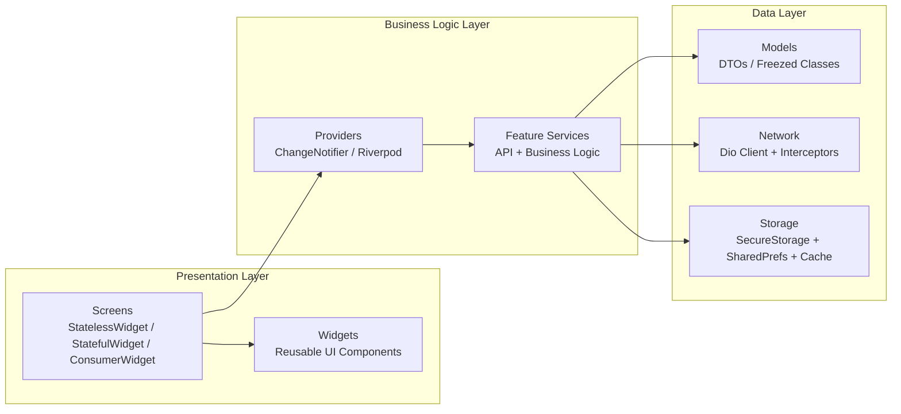

### 2.2 Design Patterns Used

| Pattern | Implementation | Description |
|---------|---------------|-------------|
| **Repository Pattern** | Feature services (`ApiStudentService`, `ApiGradeService`, etc.) | Abstracts data access from UI layer |
| **Service Locator** | `GetIt` in `service_locator.dart` | Singleton service registration and resolution |
| **Dependency Injection** | Constructor injection + GetIt | Loose coupling between services |
| **Observer Pattern** | `ChangeNotifier` + Provider/Riverpod | Reactive state management |
| **Interceptor Pattern** | Dio `Interceptor` classes | Middleware for auth, logging, error handling |
| **Factory Pattern** | `fromJson()` methods on models | Object creation from API responses |
| **Facade Pattern** | `PreferencesService`, `LocalCacheService` | Simplified interface to complex subsystems |
| **Strategy Pattern** | Export services (PDF vs Excel) | Interchangeable export algorithms |
| **Singleton Pattern** | Global `navigatorKey`, `languageProvider` | Single instance across app lifecycle |
| **Builder Pattern** | `CacheKeyBuilder` | Fluent API for constructing cache keys |

### 2.3 Feature Module Structure

Each feature follows this consistent pattern:

```
lib/features/<feature_name>/
├── screens/           # Page-level widgets (routed screens)
│   ├── admin_<feature>_screen.dart      # Admin view
│   ├── teacher_<feature>_screen.dart    # Teacher view
│   └── parent_<feature>_screen.dart     # Parent view
├── services/          # API calls + business logic
│   └── <feature>_service.dart
├── widgets/           # Feature-specific UI components
│   ├── <feature>_list_item.dart
│   └── <feature>_form_dialog.dart
└── exports/           # PDF/Excel export services
    └── <feature>_export_service.dart
```

---

## 3. Data Models & Schema

### 3.1 Core Models

#### User
```dart
class User {
  String id;          // UUID from backend
  String name;        // Full name
  String email;       // Login email
  String password;    // (Only used during registration)
  String role;        // 'admin' | 'guru' | 'wali' | 'staff'
  String? classroom;  // Assigned classroom (for teachers)
}
```

**Description:** Represents an authenticated user. A single person can have multiple roles across multiple schools. The `role` field indicates the currently active role after login/switch.

#### Student (Freezed - Immutable)
```dart
@freezed
class Student {
  String id;              // UUID
  String name;            // Student full name
  String className;       // Display name of assigned class
  String studentNumber;   // NIS (Nomor Induk Siswa)
  String address;         // Home address
  String guardianName;    // Parent/guardian name
  String phoneNumber;     // Contact phone
  String? classId;        // FK to Classroom
  String? studentClassId; // FK to pivot table (student_class)
}
```

**Description:** Uses Freezed for immutability and value equality. The `fromJson` factory handles two different API response shapes — flat (when class data is inline) and nested (when class data is in a relationship object).

#### Teacher
```dart
class Teacher {
  String id;    // UUID
  String name;  // Teacher full name
}
```

**Description:** Lightweight model used for dropdown selections and references. Full teacher data is typically accessed via the User model.

#### Classroom
```dart
class Classroom {
  String id;                // UUID
  String name;              // e.g., "Kelas 7A", "Kelas 12 IPA 1"
  String homeroomTeacher;   // Name of homeroom teacher (wali kelas)
  int studentCount;         // Number of enrolled students
}
```

**Description:** Represents a class/section. Each classroom has one homeroom teacher and multiple students.

#### Grade
```dart
class Grade {
  String studentId;   // FK to Student
  String subject;     // Subject name
  String semester;    // e.g., "Semester 1", "Semester 2"
  double score;       // Numeric grade (0-100)
}
```

**Description:** Individual grade entry for a student in a specific subject and semester.

#### Attendance
```dart
class Attendance {
  String studentId;   // FK to Student
  String status;      // 'hadir' | 'sakit' | 'izin' | 'alpha'
  DateTime date;      // Attendance date
}
```

**Description:** Daily attendance record. Statuses: `hadir` (present), `sakit` (sick), `izin` (excused), `alpha` (absent without notice).

#### Announcement
```dart
class Announcement {
  String id;          // UUID
  String title;       // Announcement title
  String content;     // Rich text content
  String category;    // Category tag
  DateTime date;      // Publication date
}
```

**Description:** School-wide or role-targeted announcements with optional file attachments.

#### Activity
```dart
class Activity {
  String id;           // UUID
  String name;         // Activity name
  String description;  // Details
  String location;     // Venue
  DateTime date;       // Date of activity
}
```

**Description:** Represents extracurricular or class activities.

#### AttendanceSummary (Freezed - Immutable)
```dart
@freezed
class AttendanceSummary {
  String id;            // UUID
  String subjectId;     // FK to Subject
  String subjectName;   // Subject display name
  DateTime date;        // Summary date
  int totalStudents;    // Total students in class
  int present;          // Count present
  int absent;           // Count absent
}
```

**Description:** Aggregated attendance statistics per subject per day.

#### PaginationMeta & PaginatedResponse
```dart
class PaginationMeta {
  int totalItems;     // Total records in database
  int totalPages;     // Total pages available
  int currentPage;    // Current page number (1-based)
  int perPage;        // Items per page
  bool hasNextPage;   // Whether next page exists
  bool hasPrevPage;   // Whether previous page exists
  int? nextPage;      // Next page number (null if last)
  int? prevPage;      // Previous page number (null if first)
}

class PaginatedResponse<T> {
  bool success;           // API success flag
  List<T> data;           // Page items
  PaginationMeta pagination;  // Pagination metadata
}
```

**Description:** Generic paginated response wrapper used across all list endpoints. The backend returns this consistent format for all paginated data.

---

## 4. Entity Relationship Diagram (ERD)

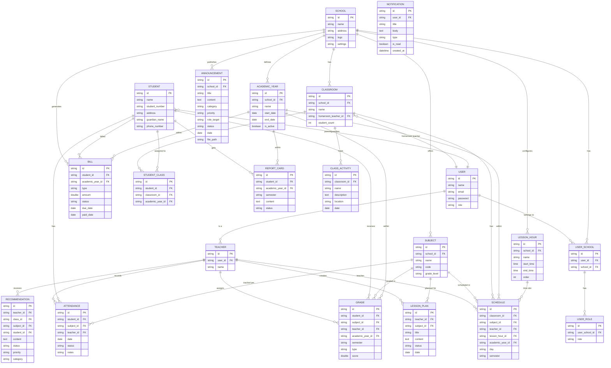

---

## 5. Authentication & Authorization Flow

### 5.1 Login Flow (Multi-Step)

The authentication flow supports multi-school and multi-role scenarios with OTP verification:

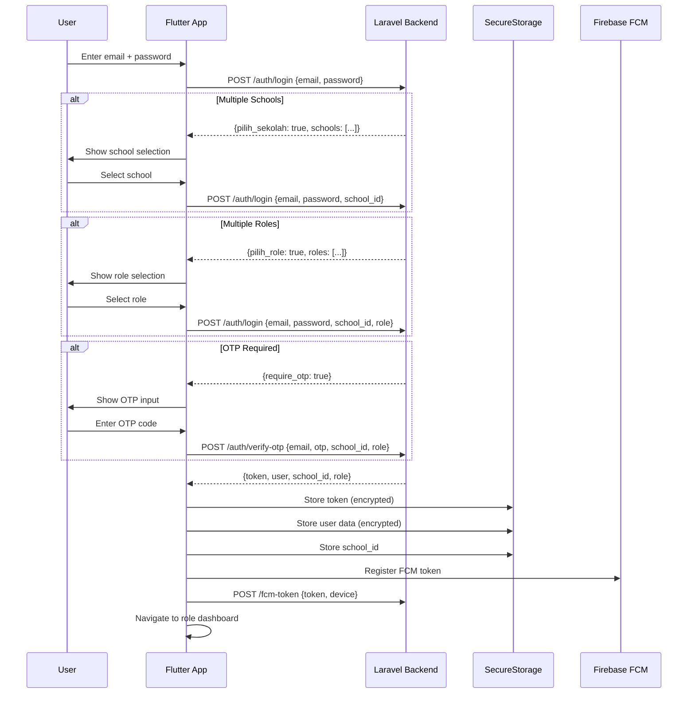

### 5.2 Google OAuth Flow

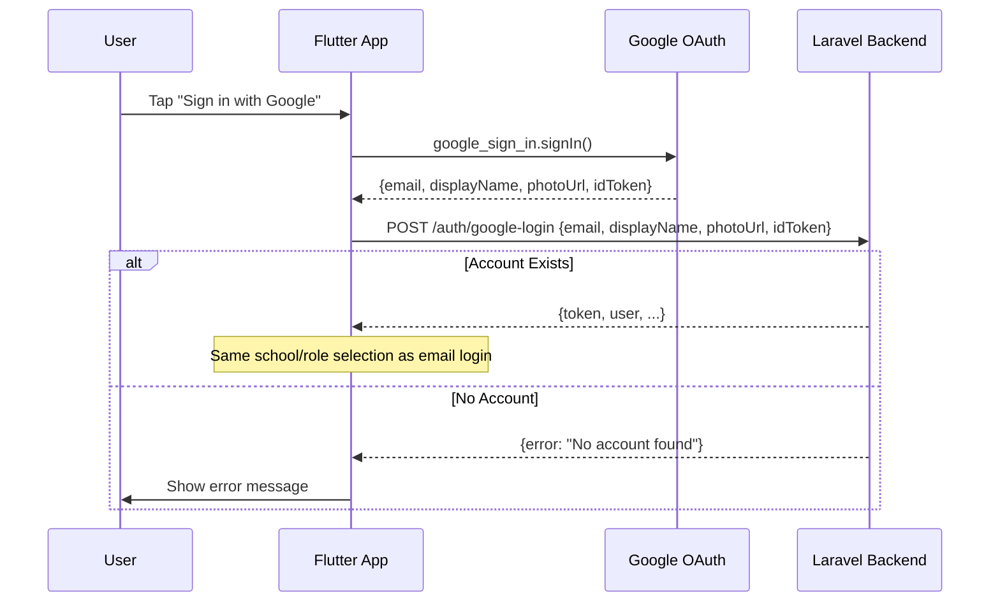

### 5.3 Token Management

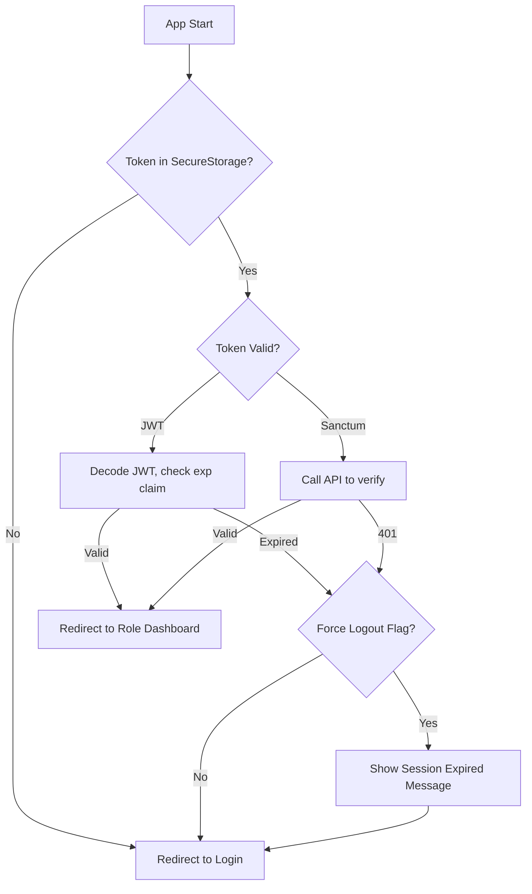

**Token Types Supported:**
- **JWT (JSON Web Token)** — Decoded locally to check expiration via `jwt_decoder` package
- **Laravel Sanctum** — Opaque token validated by making an API call

**Storage:** All tokens are stored in `SecureStorageService` which uses:
- iOS: Keychain
- Android: EncryptedSharedPreferences
- macOS: Keychain

### 5.4 Auth Guard (GoRouter Redirect)

Every route change passes through the auth guard in `app_router.dart`:

```dart
redirect: (context, state) async {
  final isLoggedIn = await tokenService.isLoggedIn();
  final isLoginPage = state.matchedLocation == '/login';

  if (!isLoggedIn && !isLoginPage) return '/login';
  if (isLoggedIn && (isLoginPage || state.matchedLocation == '/')) {
    final userData = await tokenService.getUserData();
    final role = userData?['role'] ?? 'admin';
    return '/$role';  // /admin, /guru, /wali, /staff
  }
  return null;  // No redirect
}
```

---

## 6. Role-Based Access Control (RBAC)

### 6.1 Role Hierarchy

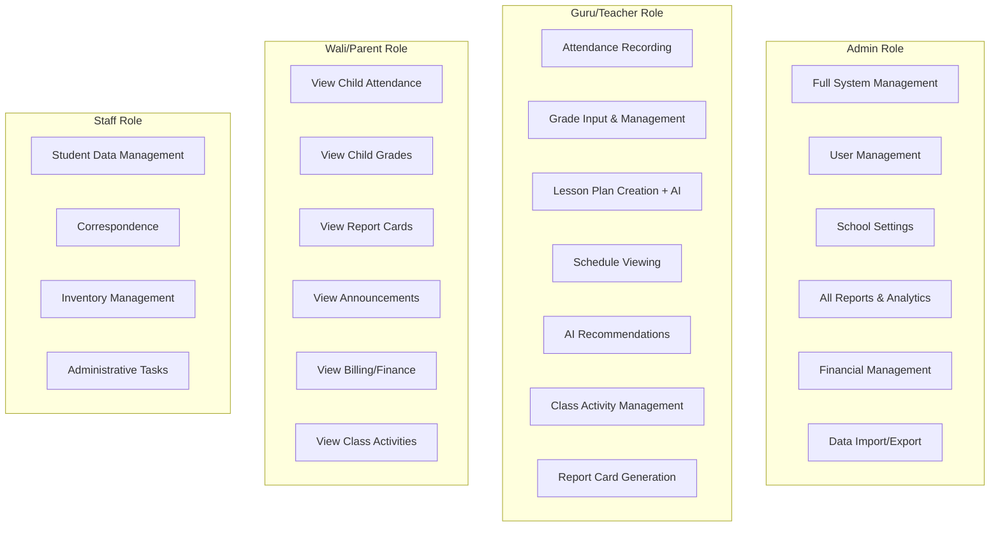

### 6.2 Feature Access Matrix

| Feature | Admin | Guru (Teacher) | Wali (Parent) | Staff |
|---------|:-----:|:------:|:------:|:-----:|
| Dashboard (Full Stats) | ✅ | ✅ (own classes) | ✅ (own children) | ✅ |
| Student Management (CRUD) | ✅ | ❌ (view only) | ❌ (own child only) | ✅ |
| Teacher Management | ✅ | ❌ | ❌ | ❌ |
| Classroom Management | ✅ | ❌ | ❌ | ❌ |
| Subject Management | ✅ | ❌ | ❌ | ❌ |
| Schedule Management | ✅ | ✅ (view own) | ❌ | ❌ |
| Attendance (Record) | ✅ | ✅ | ❌ | ❌ |
| Attendance (View) | ✅ | ✅ | ✅ (own child) | ❌ |
| Grade Input | ✅ | ✅ | ❌ | ❌ |
| Grade View | ✅ | ✅ | ✅ (own child) | ❌ |
| Lesson Plans (Create) | ✅ | ✅ | ❌ | ❌ |
| AI Lesson Plan Generation | ❌ | ✅ | ❌ | ❌ |
| AI Recommendations | ❌ | ✅ | ❌ | ❌ |
| Announcements (Create) | ✅ | ❌ | ❌ | ❌ |
| Announcements (View) | ✅ | ✅ | ✅ | ✅ |
| Report Cards | ✅ | ✅ | ✅ (own child) | ❌ |
| Finance/Billing | ✅ | ❌ | ✅ (own bills) | ❌ |
| School Settings | ✅ | ❌ | ❌ | ❌ |
| Data Import/Export | ✅ | ❌ | ❌ | ❌ |
| Notifications | ✅ | ✅ | ✅ | ✅ |
| Correspondence | ❌ | ❌ | ❌ | ✅ |
| Inventory | ❌ | ❌ | ❌ | ✅ |

### 6.3 Dashboard Customization per Role

Each role sees a different dashboard with tailored widgets:

**Admin Dashboard:**
- Total statistics (students, teachers, classes, subjects)
- Attendance overview chart (all classes)
- Finance chart and billing summary
- Quick actions: manage students, teachers, classes, announcements
- Recent announcements
- Lesson plan completion status

**Guru (Teacher) Dashboard:**
- Own class statistics
- Today's schedule slider
- Attendance overview for own classes
- Quick actions: record attendance, input grades, create lesson plan
- AI recommendation badges
- Material slider for current classes

**Wali (Parent) Dashboard:**
- Child's attendance summary
- Latest grades
- Upcoming bills/payments
- Recent announcements
- Report card access
- Class activity feed

---

## 7. API Service Layer & Endpoints

### 7.1 API Architecture

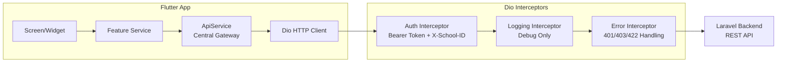

### 7.2 Complete API Endpoint Catalog

#### Authentication Endpoints

| Method | Endpoint | Description | Auth Required |
|--------|----------|-------------|:---:|
| POST | `/auth/login` | Email/password login | ❌ |
| POST | `/auth/verify-otp` | OTP verification | ❌ |
| POST | `/auth/google-login` | Google OAuth login | ❌ |
| POST | `/auth/logout` | Logout & invalidate token | ✅ |
| POST | `/auth/switch-school` | Switch active school | ✅ |
| POST | `/auth/switch-role` | Switch active role | ✅ |

#### User Endpoints

| Method | Endpoint | Description |
|--------|----------|-------------|
| GET | `/user/roles` | Get user's roles across schools |
| GET | `/user/schools` | Get user's school memberships |

#### Dashboard

| Method | Endpoint | Description |
|--------|----------|-------------|
| GET | `/dashboard/stats` | Role-specific dashboard statistics |

#### Student Endpoints

| Method | Endpoint | Description |
|--------|----------|-------------|
| GET | `/student` | List students (with filters) |
| GET | `/student/{id}` | Get student by ID |
| POST | `/student` | Create student |
| PUT | `/student/{id}` | Update student |
| DELETE | `/student/{id}` | Delete student |
| GET | `/student/template` | Download import template |
| POST | `/student/import` | Import from Excel |
| GET | `/student/{id}/parent` | Get parent user data |
| GET | `/student/filter-options` | Get available filter values |

#### Teacher Endpoints

| Method | Endpoint | Description |
|--------|----------|-------------|
| GET | `/teacher` | List teachers |
| GET | `/teacher/{id}` | Get teacher by ID |
| POST | `/teacher` | Create teacher |
| PUT | `/teacher/{id}` | Update teacher |
| DELETE | `/teacher/{id}` | Delete teacher |
| GET | `/teacher/template` | Download import template |
| POST | `/teacher/import` | Import from Excel |
| GET | `/teacher/by-user` | Get teacher by logged-in user |

#### Classroom Endpoints

| Method | Endpoint | Description |
|--------|----------|-------------|
| GET | `/class` | List classrooms |
| GET | `/class/{id}` | Get classroom by ID |
| POST | `/class` | Create classroom |
| PUT | `/class/{id}` | Update classroom |
| DELETE | `/class/{id}` | Delete classroom |
| GET | `/class/template` | Download import template |
| POST | `/class/import` | Import from Excel |
| GET | `/class/filter-options` | Get filter values |
| POST | `/class/promote` | Promote students to next class |
| POST | `/class/{id}/assign-students` | Assign students to class |

#### Subject Endpoints

| Method | Endpoint | Description |
|--------|----------|-------------|
| GET | `/subject` | List subjects |
| GET | `/subject/{id}` | Get subject by ID |
| POST | `/subject` | Create subject |
| PUT | `/subject/{id}` | Update subject |
| DELETE | `/subject/{id}` | Delete subject |
| GET | `/subject/template` | Download import template |
| POST | `/subject/import` | Import from Excel |

#### Schedule Endpoints

| Method | Endpoint | Description |
|--------|----------|-------------|
| GET | `/schedule` | List schedules (paginated + filtered) |
| POST | `/schedule` | Create schedule |
| PUT | `/schedule/{id}` | Update schedule |
| DELETE | `/schedule/{id}` | Delete schedule |
| GET | `/schedule/template` | Download import template |
| POST | `/schedule/import` | Import from Excel |
| POST | `/schedule/check-conflicts` | Check for scheduling conflicts |
| GET | `/schedule/export` | Export as file |
| GET | `/schedule/filter-options` | Get filter values |
| GET | `/hari` | Get school days |
| GET | `/semester` | Get semesters |
| GET | `/academic-year` | Get academic years |
| GET | `/lesson-hour-session` | Get lesson hour slots |

#### Attendance Endpoints

| Method | Endpoint | Description |
|--------|----------|-------------|
| GET | `/attendance` | List attendance records |
| POST | `/attendance` | Mark attendance |
| PUT | `/attendance/{id}` | Update attendance |
| GET | `/attendance/summary` | Attendance summary stats |
| GET | `/attendance/stats` | Detailed attendance statistics |
| GET | `/attendance/unread-count` | Unread attendance notifications |
| PUT | `/attendance/{id}/read` | Mark as read |
| GET | `/attendance/export` | Export attendance data |

#### Grade Endpoints

| Method | Endpoint | Description |
|--------|----------|-------------|
| GET | `/grades` | List grades |
| GET | `/grade/{id}` | Get grade by ID |
| POST | `/grade` | Create grade |
| PUT | `/grade/{id}` | Update grade |
| DELETE | `/grade/{id}` | Delete grade |
| GET | `/grades/by-subject/{id}` | Grades for specific subject |
| GET | `/grade/unread-count` | Unread grade notifications |
| PUT | `/grade/{id}/read` | Mark as read |
| GET | `/grades/export` | Export grades |
| GET | `/grade-recaps` | Grade recap/summary |
| GET | `/grade-recaps/export` | Export recap |

#### Lesson Plan (RPP) Endpoints

| Method | Endpoint | Description |
|--------|----------|-------------|
| GET | `/rpp` | List lesson plans |
| GET | `/rpp/{id}` | Get lesson plan by ID |
| POST | `/rpp` | Create lesson plan |
| PUT | `/rpp/{id}` | Update lesson plan |
| DELETE | `/rpp/{id}` | Delete lesson plan |
| POST | `/upload/rpp` | Upload lesson plan file |
| GET | `/rpp/{id}/download` | Download lesson plan |
| GET | `/rpp/template` | Download import template |
| POST | `/rpp/import` | Import from Excel |

#### Announcement Endpoints

| Method | Endpoint | Description |
|--------|----------|-------------|
| GET | `/announcement` | List announcements (paginated) |
| POST | `/announcement` | Create announcement (multipart) |
| PUT | `/announcement/{id}` | Update announcement |
| DELETE | `/announcement/{id}` | Delete announcement |
| GET | `/announcement/unread-count` | Unread count |
| GET | `/announcement/filter-options` | Filter values |

#### Class Activity Endpoints

| Method | Endpoint | Description |
|--------|----------|-------------|
| GET | `/class-activity` | List class activities |
| POST | `/class-activity` | Create activity |
| PUT | `/class-activity/{id}` | Update activity |
| DELETE | `/class-activity/{id}` | Delete activity |
| GET | `/class-activity/export` | Export activities |

#### Report Card Endpoints

| Method | Endpoint | Description |
|--------|----------|-------------|
| GET | `/raport` | List report cards |
| GET | `/raport/{id}` | Get report card by ID |
| POST | `/raport/generate` | Generate report card |
| GET | `/raport/{id}/export` | Export report card |

#### Finance/Billing Endpoints

| Method | Endpoint | Description |
|--------|----------|-------------|
| GET | `/finance/dashboard` | Finance dashboard data |
| GET | `/finance/dashboard/chart` | Finance chart data |
| GET | `/bills` | List bills |
| GET | `/bills/{id}` | Get bill by ID |
| POST | `/bills` | Create bill |
| PUT | `/bills/{id}` | Update bill |
| POST | `/generate-bill` | Bulk generate bills |
| POST | `/payment/manual` | Record manual payment |
| GET | `/bills/generated-months` | Already generated months |
| GET | `/bills/stats` | Billing statistics |
| GET | `/bills/unread-count` | Unread bill notifications |
| PUT | `/bills/{id}/read` | Mark bill as read |
| PUT | `/bills/read-all` | Mark all bills as read |

#### Notification Endpoints

| Method | Endpoint | Description |
|--------|----------|-------------|
| GET | `/notification` | List notifications |
| POST | `/notification` | Create notification |
| PUT | `/notification/{id}/read` | Mark as read |
| PUT | `/notification/read-all` | Mark all as read |

#### Settings Endpoints

| Method | Endpoint | Description |
|--------|----------|-------------|
| GET | `/school-settings` | Get school settings |
| PUT | `/school-settings` | Update school settings |
| GET | `/profile` | Get user profile |
| PUT | `/profile` | Update profile |
| PUT | `/profile/password` | Change password |
| GET | `/academic-year` | List academic years |
| GET | `/grade-levels` | List grade levels |
| GET | `/lesson-hour-session` | Lesson hour configuration |

#### FCM Token Endpoints

| Method | Endpoint | Description |
|--------|----------|-------------|
| POST | `/fcm-token` | Register device FCM token |
| DELETE | `/fcm/token` | Unregister FCM token |

### 7.3 Request/Response Patterns

**Standard Headers (via Auth Interceptor):**
```
Authorization: Bearer <token>
X-School-ID: <school_id>
Content-Type: application/json
Accept: application/json
```

**Standard Paginated Response:**
```json
{
  "success": true,
  "data": [...],
  "pagination": {
    "total_items": 150,
    "total_pages": 15,
    "current_page": 1,
    "per_page": 10,
    "has_next_page": true,
    "has_prev_page": false,
    "next_page": 2,
    "prev_page": null
  }
}
```

**Error Response:**
```json
{
  "success": false,
  "message": "Validation error",
  "errors": {
    "name": ["The name field is required."],
    "email": ["The email has already been taken."]
  }
}
```

---

## 8. Screen Flow & Navigation

### 8.1 Top-Level Navigation

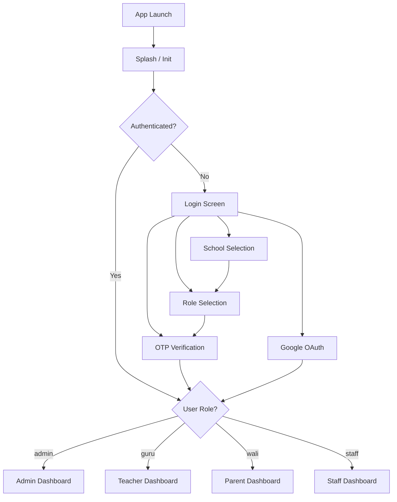

### 8.2 Admin Navigation Map

```mermaid
flowchart TD
    ADMIN[Admin Dashboard] --> STUDENTS[Student Management]
    ADMIN --> TEACHERS[Teacher Management]
    ADMIN --> CLASSES[Classroom Management]
    ADMIN --> SUBJECTS[Subject Management]
    ADMIN --> SCHEDULE[Schedule Management]
    ADMIN --> ATTENDANCE_R[Attendance Reports]
    ADMIN --> GRADES_R[Grade Reports]
    ADMIN --> LESSON_PLANS[Lesson Plans]
    ADMIN --> ANNOUNCE[Announcements]
    ADMIN --> ACTIVITIES[Class Activities]
    ADMIN --> REPORT_CARDS[Report Cards]
    ADMIN --> FINANCE[Finance/Billing]
    ADMIN --> SETTINGS[Settings]
    ADMIN --> NOTIFICATIONS[Notifications]

    STUDENTS --> STU_DETAIL[Student Detail]
    STUDENTS --> STU_IMPORT[Import Excel]

    TEACHERS --> TEACH_DETAIL[Teacher Detail]
    TEACHERS --> TEACH_IMPORT[Import Excel]

    CLASSES --> CLASS_FORM[Create/Edit Class]
    CLASSES --> CLASS_PROMO[Class Promotion Wizard]

    SCHEDULE --> SCHED_FORM[Create/Edit Schedule]
    SCHEDULE --> SCHED_CONFLICT[Conflict Resolution]

    ATTENDANCE_R --> ATT_DETAIL[Attendance Detail]

    GRADES_R --> GRADE_RECAP[Grade Recap]

    FINANCE --> FIN_CLASS[Class Finance Report]

    SETTINGS --> SCHOOL_SET[School Settings]
    SETTINGS --> LEVEL_SET[Grade Level Settings]
    SETTINGS --> TIME_SET[Time/Lesson Hour Settings]
    SETTINGS --> DATA_MGT[Data Management]
    SETTINGS --> REPORT_SET[Reports/Logs]
```

### 8.3 Teacher Navigation Map

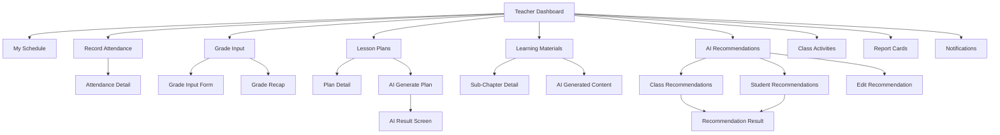

### 8.4 Parent Navigation Map

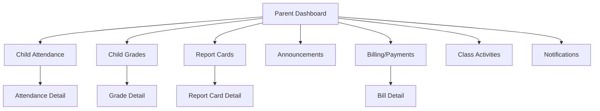

### 8.5 GoRouter Route Configuration

| Path | Screen | Role | Description |
|------|--------|------|-------------|
| `/login` | `LoginScreen` | Any | Authentication page |
| `/admin` | `Dashboard(role: 'admin')` | Admin | Admin dashboard |
| `/guru` | `Dashboard(role: 'guru')` | Guru | Teacher dashboard |
| `/wali` | `Dashboard(role: 'wali')` | Wali | Parent dashboard |
| `/staff` | `Dashboard(role: 'staff')` | Staff | Staff dashboard |

**Note:** Feature screens are navigated via `Navigator.push()` from the dashboard, not via GoRouter paths. GoRouter handles only the top-level role routing and auth redirects.

---

## 9. State Management

### 9.1 Architecture Overview

The app uses a **hybrid state management** approach combining three patterns:

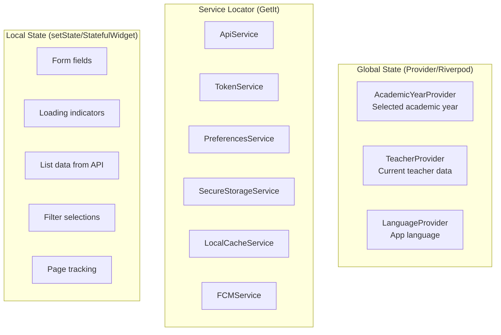

### 9.2 Provider (Legacy Pattern)

Used for global state that needs to be accessible across the widget tree:

```dart
// Provider registration in main.dart
MultiProvider(
  providers: [
    ChangeNotifierProvider(create: (_) => AcademicYearProvider()),
    ChangeNotifierProvider(create: (_) => TeacherProvider()),
    ChangeNotifierProvider(create: (_) => languageProvider),
  ],
  child: MaterialApp.router(...)
)

// Consuming in widgets
final academicYear = Provider.of<AcademicYearProvider>(context);

Consumer<AcademicYearProvider>(
  builder: (context, provider, child) => DropdownButton(
    value: provider.selectedAcademicYearId,
    items: provider.academicYears.map(...).toList(),
    onChanged: (id) => provider.setSelectedYear(id),
  ),
)
```

### 9.3 Riverpod (Modern Pattern)

Being gradually introduced for better testability and compile-time safety:

```dart
// Provider definitions
final academicYearRiverpod = ChangeNotifierProvider(
  (ref) => AcademicYearProvider(),
);
final teacherRiverpod = ChangeNotifierProvider(
  (ref) => TeacherProvider(),
);
final languageRiverpod = ChangeNotifierProvider(
  (ref) => languageProvider,
);

// Root widget
ProviderScope(child: SchoolManagementApp())

// Consuming in ConsumerWidget
class MyScreen extends ConsumerWidget {
  Widget build(BuildContext context, WidgetRef ref) {
    final academicYear = ref.watch(academicYearRiverpod);
    return Text(academicYear.selectedAcademicYearId ?? 'None');
  }
}
```

### 9.4 AcademicYearProvider (Key Global State)

```dart
class AcademicYearProvider extends ChangeNotifier {
  String? _selectedAcademicYearId;
  List<dynamic> _academicYears = [];

  String? get selectedAcademicYearId => _selectedAcademicYearId;
  List<dynamic> get academicYears => _academicYears;

  void setSelectedYear(String id) {
    _selectedAcademicYearId = id;
    notifyListeners();  // Rebuilds all listening widgets
  }

  Future<void> fetchAcademicYears() async {
    _academicYears = await ApiService.getAcademicYears();
    // Auto-select active year
    final active = _academicYears.firstWhere(
      (y) => y['is_active'] == true,
      orElse: () => _academicYears.first,
    );
    _selectedAcademicYearId = active['id'];
    notifyListeners();
  }
}
```

### 9.5 Data Flow Pattern

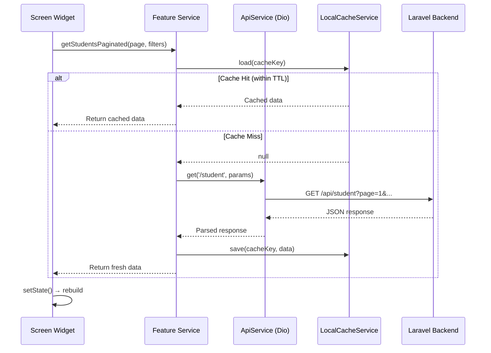

---

## 10. AI-Powered Features

### 10.1 Overview

The application integrates two distinct AI systems:

| Feature | AI Provider | Model | Purpose |
|---------|------------|-------|---------|
| Lesson Plan Generation | OpenAI | GPT-3.5-turbo | Auto-generate K13-format RPP |
| Teaching Recommendations | KamillLabs Edu AI | Custom ML | Personalized teaching suggestions |

### 10.2 AI Lesson Plan Generation (RPP)

#### Architecture

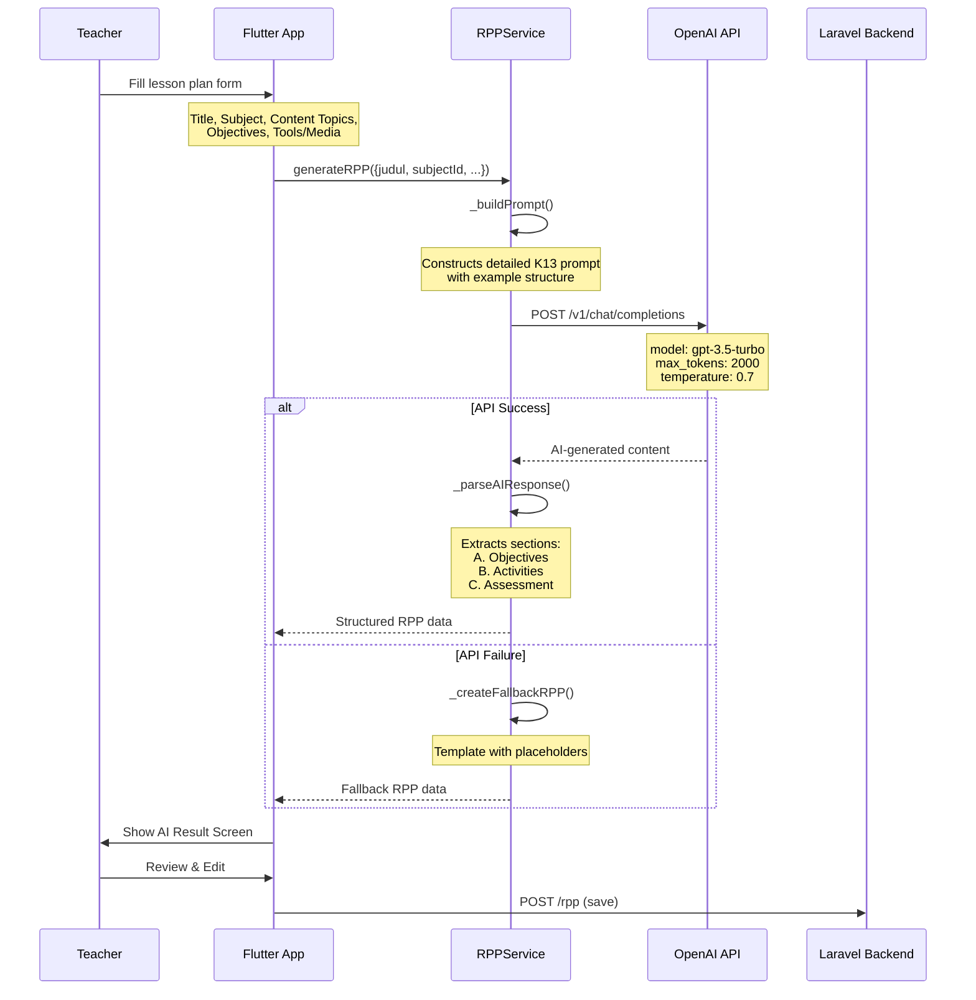

#### Prompt Engineering

The RPP service constructs a detailed prompt that includes:

1. **Context:** "Anda adalah seorang guru profesional di Indonesia" (You are a professional teacher in Indonesia)
2. **Subject & Topics:** The specific subject name and content material list
3. **Format Requirements:** K13 (Kurikulum 2013) structure with sections:
   - **A. Tujuan Pembelajaran** (Learning Objectives) — Clear, measurable objectives
   - **B. Kegiatan Pembelajaran** (Learning Activities) — Divided into Pendahuluan (Opening), Inti (Core), Penutup (Closing) with time allocations
   - **C. Penilaian/Asesmen** (Assessment) — Evaluation methods and rubrics
4. **Example Output:** A complete example RPP is provided in the prompt for few-shot learning

#### AI Response Parsing

The `_parseAIResponse` method extracts structured sections from the AI's free-text response:
```dart
Map _parseAIResponse(String content) {
  return {
    'tujuan_pembelajaran': _extractSection(content, 'Tujuan Pembelajaran'),
    'kegiatan_pembelajaran': _extractSection(content, 'Kegiatan Pembelajaran'),
    'penilaian': _extractSection(content, 'Penilaian'),
  };
}
```

#### Fallback Strategy

If the OpenAI API fails (network error, rate limit, etc.), the service generates a template RPP with:
- Pre-filled section headers
- Placeholder content based on the provided topics
- Teacher can then manually fill in the details

### 10.3 AI Teaching Recommendations

#### Architecture

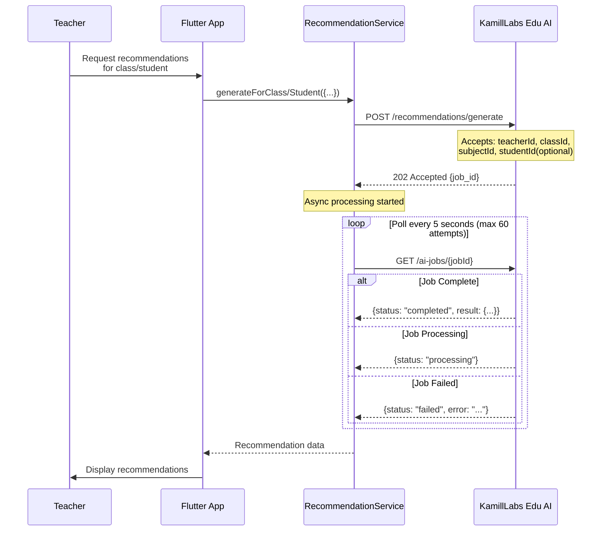

#### API Integration Details

**Base URL:** `https://edu-ai-api.kamillabs.com/api`

**Key Endpoints:**

| Method | Path | Description |
|--------|------|-------------|
| POST | `/recommendations/generate` | Generate for entire class |
| POST | `/recommendations/generate-student` | Generate for specific student |
| GET | `/ai-jobs/{jobId}` | Poll async job status |
| GET | `/recommendations` | List recommendations (filterable) |
| GET | `/recommendations/{id}` | Get recommendation detail |
| PATCH | `/recommendations/{id}/status` | Update recommendation status |
| GET | `/recommendations/class/{id}/summary` | Class-level summary |

**Recommendation Statuses:**
- `pending` — Generated but not yet reviewed
- `in_progress` — Teacher is working on it
- `completed` — Action taken
- `dismissed` — Teacher dismissed it

**Recommendation Properties:**
- `content` — AI-generated teaching suggestion text
- `priority` — Priority level
- `category` — Category of recommendation
- `teacher_notes` — Teacher's notes on the recommendation

**Rate Limiting:**
The AI API enforces rate limits. When a 429 status is returned, the service throws a `RateLimitException` which the UI handles gracefully with a retry message.

**Authentication:**
The AI service uses its own auth interceptor (`_AiAuthInterceptor`) that only sends the Bearer token (no X-School-ID header), as the AI service is a separate microservice from the main Laravel backend.

### 10.4 AI Feature User Flow

```mermaid
flowchart TD
    subgraph "Lesson Plan AI Flow"
        LP1[Teacher opens Lesson Plans] --> LP2[Taps 'Generate with AI']
        LP2 --> LP3[Fills form:<br/>Title, Subject, Topics, Objectives]
        LP3 --> LP4[AI generates K13 RPP]
        LP4 --> LP5[Teacher reviews on AI Result Screen]
        LP5 --> LP6{Satisfied?}
        LP6 -->|Yes| LP7[Save lesson plan]
        LP6 -->|Edit| LP8[Modify content]
        LP8 --> LP7
    end

    subgraph "Recommendation AI Flow"
        RC1[Teacher opens Recommendations] --> RC2[Select Class & Subject]
        RC2 --> RC3[Tap 'Generate Recommendations']
        RC3 --> RC4[Async job starts<br/>Polling every 5s]
        RC4 --> RC5[View class-level recommendations]
        RC5 --> RC6[Drill into student-level]
        RC6 --> RC7[Update status:<br/>in_progress → completed]
        RC7 --> RC8[Add teacher notes]
    end
```

---

## 11. Feature Modules (Detailed)

### 11.1 Student Management

**Service:** `ApiStudentService`
**Screens:** `AdminStudentManagementScreen`, `StudentDetailScreen`

**Capabilities:**
- Full CRUD for student records
- Paginated list with search and filters (class, name, student number)
- Import students from Excel template
- Download import template
- View parent/guardian user data
- Filter options fetched from backend (dynamic dropdowns)
- Local caching with TTL for list queries

**Data Flow:**
```
Admin opens Students → Fetch paginated list (cached) → Display list
→ Search/Filter → Re-fetch with params → Update list
→ Tap student → Fetch detail → Show StudentDetailScreen
→ Create/Edit → Form dialog → POST/PUT → Invalidate cache → Refresh
→ Import → Pick Excel file → Upload → Show result → Refresh
```

### 11.2 Teacher Management

**Service:** `ApiTeacherService`
**Screens:** `AdminTeacherManagementScreen`, `TeacherDetailScreen`

**Capabilities:**
- Full CRUD for teacher records
- Paginated list with search
- Import from Excel
- Fetch teacher by logged-in user (for teacher's own data)
- Cached list queries

### 11.3 Classroom Management

**Service:** `ApiClassroomService`
**Screens:** `AdminClassroomManagementScreen`, `ClassPromotionWizard`

**Capabilities:**
- Full CRUD for classrooms
- Import from Excel
- Filter options (grade level, homeroom teacher)
- **Class Promotion Wizard** — Multi-step wizard for promoting students to next grade level at end of academic year
- Student assignment to classes

**Class Promotion Flow:**
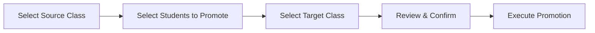

### 11.4 Subject Management

**Service:** `ApiSubjectService`
**Screens:** `AdminSubjectManagementScreen`

**Capabilities:**
- Full CRUD for subjects
- Import from Excel
- Paginated list with filters

### 11.5 Schedule Management

**Service:** `ApiScheduleService`
**Screens:** `AdminScheduleManagementScreen`, `TeacherScheduleScreen`

**Capabilities:**
- Full CRUD for schedule entries
- Reference data: days (`hari`), semesters, academic years, lesson hours
- **Conflict Detection** — Before saving, checks for teacher/room conflicts
- Import from Excel with conflict resolution
- Export schedules
- DataGrid (Syncfusion) timetable view
- Teacher view: filtered to logged-in teacher's schedule
- Cached with manual invalidation after mutations

**Conflict Detection Flow:**
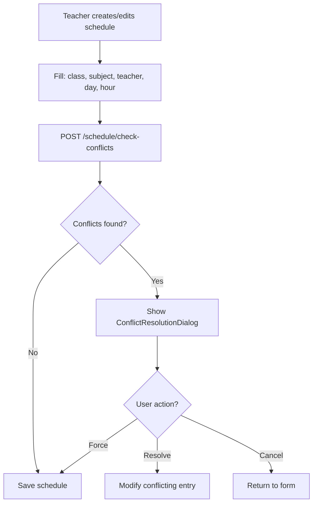

### 11.6 Attendance Tracking

**Service:** `ApiAttendanceService`
**Screens:** Teacher, Admin, and Parent attendance screens

**Capabilities:**
- Record attendance per student per subject per day
- Statuses: `hadir` (present), `sakit` (sick), `izin` (excused), `alpha` (absent)
- Attendance summary and statistics
- Unread count for parents (new attendance records)
- Mark-as-read functionality
- Export to PDF/Excel
- Role-specific views (teacher records, admin reports, parent views)

**Attendance Recording Flow:**
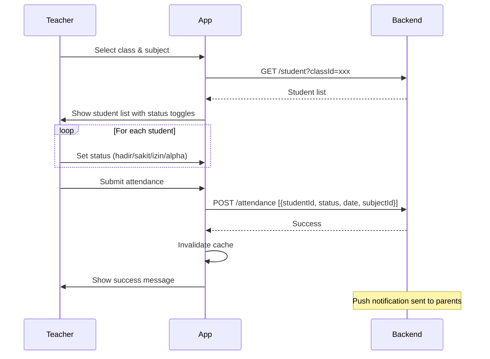

### 11.7 Grade Management

**Service:** `ApiGradeService`, `GradeRecapService`
**Screens:** Grade book, input forms, recap views for teacher/admin/parent

**Capabilities:**
- Grade entry per student per subject per semester
- Grade book spreadsheet view (Syncfusion DataGrid)
- Grade types support (quiz, exam, assignment, etc.)
- Grade recap/summary across subjects
- Unread notifications for parents
- Export grades and recaps to PDF/Excel
- Filter by academic year, semester, class, subject

### 11.8 Lesson Plans (RPP)

**Service:** `ApiLessonPlanService`, `RPPService` (AI)
**Screens:** Admin view, teacher view, detail, AI generation, AI result

**Capabilities:**
- Full CRUD for lesson plans
- **AI-Powered Generation** (see Section 10.2)
- File upload/download for lesson plan documents
- Import from Excel
- Rich text editing with Flutter Quill
- Export to PDF

### 11.9 Learning Materials

**Screens:** `TeacherMaterialScreen`, `SubChapterDetailScreen`, `MaterialAIResultScreen`

**Capabilities:**
- Browse and manage learning materials organized by chapters/sub-chapters
- AI-generated content for learning materials
- Material detail view with rich content

### 11.10 Announcements

**Service:** `ApiAnnouncementService`
**Screens:** Admin create/manage, parent view

**Capabilities:**
- Create announcements with title, content, category, priority
- Target specific roles (all, teachers, parents, etc.)
- File attachment support (multipart upload)
- Unread count tracking
- Filter by priority, role target, status
- Paginated list

### 11.11 Class Activities

**Service:** `ApiClassActivityService`
**Screens:** Admin, teacher, and parent views

**Capabilities:**
- CRUD for class activities (events, field trips, etc.)
- Export to PDF/Excel
- Role-specific views

### 11.12 Report Cards

**Service:** `ApiReportCardService`
**Screens:** Admin, teacher, parent views with detail and print screens

**Capabilities:**
- View and generate report cards
- AI-assisted generation
- Print-friendly view
- Export to PDF
- Filter by academic year and semester

### 11.13 Finance & Billing

**Service:** `ApiFinanceService`
**Screens:** Admin finance dashboard, class report, parent billing

**Capabilities:**
- Finance dashboard with charts
- Bulk bill generation (monthly)
- Manual payment recording
- Bill status tracking (paid/unpaid/overdue)
- Unread notification count for parents
- Mark as read (individual and bulk)
- Statistics and reporting
- Filter by class, academic year, month

**Billing Flow:**
```mermaid
flowchart TD
    A[Admin opens Finance] --> B[View Dashboard Stats]
    B --> C[Generate Monthly Bills]
    C --> D[Select month, class, amount]
    D --> E[POST /generate-bill]
    E --> F[Bills created for all students]
    F --> G[Parents see bills in app]
    G --> H[Parent pays externally]
    H --> I[Admin records manual payment]
    I --> J[POST /payment/manual]
    J --> K[Bill status → paid]
```

### 11.14 Settings

**Service:** `ApiSettingsService`, `AcademicService`
**Screens:** Settings menu, school settings, grade levels, time settings, data management

**Capabilities:**
- School profile and settings
- Academic year management
- Grade level configuration
- Lesson hour/session timing
- User profile editing
- Password change
- Data import/export management

---

## 12. Caching Strategy

### 12.1 Cache Architecture

```mermaid
graph TD
    subgraph "Tier 1: Secure Storage"
        SS[SecureStorageService]
        SS_DATA[Auth Token<br/>User Data<br/>School ID]
    end

    subgraph "Tier 2: Preferences"
        PREF[PreferencesService]
        PREF_DATA[Language Setting<br/>Cache Metadata<br/>FCM Token Flag<br/>Theme Preferences]
    end

    subgraph "Tier 3: Local Cache"
        CACHE[LocalCacheService]
        CACHE_DATA[API Responses<br/>List Data<br/>Filter Options<br/>Dashboard Stats]
    end

    SS --> SS_DATA
    PREF --> PREF_DATA
    CACHE --> CACHE_DATA
```

### 12.2 Cache TTL Strategy

| Data Type | TTL | Invalidation |
|-----------|-----|-------------|
| Student list | 30 min | On create/update/delete/import |
| Teacher list | 30 min | On create/update/delete/import |
| Class list | 30 min | On create/update/delete |
| Schedule list | 30 min | On create/update/delete/import |
| Attendance records | 15 min | On mark/update |
| Grade records | 15 min | On create/update/delete |
| Announcements | 10 min | On create/update/delete |
| Filter options | 60 min | On related data change |
| Dashboard stats | 5 min | On page refresh |

### 12.3 Cache Key Pattern

Cache keys are built using `CacheKeyBuilder`:

```dart
String key = "student_paginated?page=1&limit=10&classId=abc&search=john";
```

The pattern includes the feature name, endpoint type, and all query parameters to ensure unique keys per query combination.

### 12.4 Cache Invalidation

```dart
// After a mutation (create/update/delete)
await LocalCacheService.clearStartingWith('student_');

// After logout
await LocalCacheService.clearAll();
```

---

## 13. Error Handling Architecture

### 13.1 Error Flow

```mermaid
flowchart TD
    subgraph "Network Layer"
        DIO_ERR[Dio Error<br/>Timeout, Connection, etc.]
        HTTP_ERR[HTTP Error<br/>4xx, 5xx]
    end

    subgraph "Interceptor Layer"
        ERR_INT[Error Interceptor]
        ERR_INT --> |401| LOGOUT[Force Logout]
        ERR_INT --> |403| FORBIDDEN[Permission Denied]
        ERR_INT --> |422| VALIDATION[Validation Errors]
        ERR_INT --> |429| RATE_LIMIT[Rate Limit Exception]
        ERR_INT --> |5xx| SERVER_ERR[Server Error]
    end

    subgraph "Service Layer"
        TRY_CATCH[try/catch in Services]
        LOG[AppLogger.error]
        REMOTE_LOG[LogService.report]
    end

    subgraph "UI Layer"
        SNACKBAR[SnackBar Message]
        ERROR_SCREEN[Error Screen Widget]
        ERROR_HANDLER[Global Error Handler]
    end

    DIO_ERR --> ERR_INT
    HTTP_ERR --> ERR_INT

    LOGOUT --> ERROR_HANDLER
    FORBIDDEN --> TRY_CATCH
    VALIDATION --> TRY_CATCH
    RATE_LIMIT --> TRY_CATCH
    SERVER_ERR --> TRY_CATCH

    TRY_CATCH --> LOG
    TRY_CATCH --> REMOTE_LOG
    TRY_CATCH --> SNACKBAR
    TRY_CATCH --> ERROR_SCREEN

    ERROR_HANDLER --> SNACKBAR
```

### 13.2 Error Types

| Error Type | HTTP Code | Handling |
|-----------|-----------|----------|
| **Unauthenticated** | 401 | Auto-logout, redirect to login |
| **Forbidden** | 403 | Show permission error |
| **Validation** | 422 | Parse field errors, show inline |
| **Rate Limited** | 429 | Show retry message with cooldown |
| **Server Error** | 500 | Show generic error, log remotely |
| **Timeout** | — | Show network error, offer retry |
| **No Connection** | — | Show offline message |

### 13.3 Global Error Stream

```dart
class AppErrorHandler {
  static final StreamController<AppError> _errorStream;

  // Subscribe in main.dart
  static void listen(void Function(AppError) onError) {
    _errorStream.stream.listen(onError);
  }

  // Emit from anywhere
  static void report(AppError error) {
    _errorStream.add(error);
  }
}
```

The root widget subscribes to this stream and shows appropriate UI (snackbar, dialog, or redirect) based on the error type.

---

## 14. Push Notifications (FCM)

### 14.1 FCM Architecture

```mermaid
sequenceDiagram
    participant BACKEND as Laravel Backend
    participant FCM as Firebase Cloud Messaging
    participant DEVICE as User's Device
    participant APP as Flutter App

    Note over APP: App startup
    APP->>FCM: Request FCM token
    FCM-->>APP: Device token
    APP->>BACKEND: POST /fcm-token {token, device_type}

    Note over BACKEND: Event occurs (attendance, grade, etc.)
    BACKEND->>FCM: Send notification {to: token, data: {...}}
    FCM->>DEVICE: Push notification

    alt App in Foreground
        DEVICE->>APP: onMessage callback
        APP->>APP: Show in-app notification
    else App in Background
        DEVICE->>DEVICE: Show system notification
        DEVICE->>APP: onMessageOpenedApp callback
        APP->>APP: Navigate to relevant screen
    else App Terminated
        DEVICE->>DEVICE: Show system notification
        DEVICE->>APP: getInitialMessage on next open
        APP->>APP: Navigate to relevant screen
    end
```

### 14.2 Notification Types

| Event | Recipients | Action on Tap |
|-------|-----------|---------------|
| New attendance record | Parent | Open attendance detail |
| New grade posted | Parent | Open grades screen |
| New announcement | All targeted roles | Open announcement detail |
| New bill generated | Parent | Open billing screen |
| Payment recorded | Parent | Open bill detail |
| Lesson plan review | Admin | Open lesson plan |

### 14.3 FCM Service Lifecycle

```dart
class FCMService {
  Future<void> initialize() {
    // 1. Request notification permissions
    // 2. Get FCM token
    // 3. Register token with backend
    // 4. Setup message handlers:
    //    - onMessage (foreground)
    //    - onMessageOpenedApp (background → tap)
    //    - getInitialMessage (terminated → tap)
    // 5. Handle token refresh
  }

  Future<void> deleteTokenFromBackend() {
    // Called during logout
    // DELETE /fcm/token
  }
}
```

---

## 15. Export System (PDF & Excel)

### 15.1 Export Architecture

Each feature that supports export has a dedicated export service:

```
lib/features/<feature>/exports/
└── <feature>_export_service.dart
```

### 15.2 Supported Exports

| Feature | PDF | Excel | Service |
|---------|:---:|:-----:|---------|
| Attendance | ✅ | ✅ | `AttendanceExportService` |
| Grades | ✅ | ✅ | `GradeExportService` |
| Grade Recaps | ✅ | ✅ | `GradeRecapExportService` |
| Lesson Plans | ✅ | — | `LessonPlanExportService` |
| Class Activities | ✅ | ✅ | `ClassActivityExportService` |
| Report Cards | ✅ | — | `ReportCardExportService` |
| Schedules | — | ✅ | Server-side export |

### 15.3 Export Libraries

- **PDF Generation:** `syncfusion_flutter_pdf` — Creates formatted PDF documents with tables, headers, and school branding
- **Excel Generation:** `syncfusion_flutter_xlsio` — Creates Excel workbooks with formatted sheets, headers, and data

### 15.4 Export Flow

```mermaid
flowchart TD
    A[User taps Export button] --> B{Export format?}
    B -->|PDF| C[Generate PDF locally]
    B -->|Excel| D[Generate Excel locally]
    B -->|Server Export| E[Download from API]

    C --> F[Syncfusion PDF API]
    F --> G[Add header, school logo]
    G --> H[Add data table]
    H --> I[Save to device]

    D --> J[Syncfusion XlsIO API]
    J --> K[Create worksheet]
    K --> L[Add headers + data]
    L --> I

    E --> M[GET /export?filters]
    M --> N[Download Uint8List]
    N --> I

    I --> O[Open share dialog / Save file]
```

---

## 16. Localization & Internationalization

### 16.1 Language Support

| Language | Code | Status |
|----------|------|--------|
| Indonesian (Bahasa) | `id` | Primary |
| English | `en` | Secondary |

### 16.2 Implementation

```dart
// LanguageProvider (global singleton)
class LanguageProvider extends ChangeNotifier {
  String _currentLanguage = 'id';  // Default: Indonesian

  Future<void> loadSavedLanguage() async {
    _currentLanguage = PreferencesService.getString('language') ?? 'id';
  }

  String getTranslatedText(Map<String, String> translations) {
    return translations[_currentLanguage] ?? translations['id'] ?? '';
  }

  void setLanguage(String lang) {
    _currentLanguage = lang;
    PreferencesService.setString('language', lang);
    notifyListeners();
  }
}

// Usage in widgets
Text(languageProvider.getTranslatedText({
  'en': 'Dashboard',
  'id': 'Dasbor',
}))

// Extension method
'Dashboard'.tr  // Translates based on current language
```

### 16.3 Translation Coverage

The app uses inline translation maps rather than `.arb` files. Each user-facing string provides both `en` and `id` translations at the point of use.

---

## 17. Design System Reference

### 17.1 Color Palette

```
┌─────────────────────────────────────────────────────┐
│  KAMIL EDU BRAND COLORS                              │
├─────────────────┬───────────────────────────────────┤
│  Primary        │  #143068  (Deep Blue)              │
│  Accent         │  #21AFE6  (Vibrant Teal)           │
│  Primary Light  │  #E8EEF7  (Light Blue Background)  │
│  Accent Light   │  #E6F7FD  (Light Teal Background)  │
├─────────────────┼───────────────────────────────────┤
│  CORPORATE BLUES                                     │
├─────────────────┼───────────────────────────────────┤
│  Blue 900       │  #1E3A8A  (Darkest headings)       │
│  Blue 700       │  #1D4ED8  (Primary actions)         │
│  Blue 600       │  #2563EB  (Interactive elements)    │
│  Blue 500       │  #3B82F6  (Hover states)            │
│  Blue 100       │  #DBEAFE  (Light backgrounds)       │
├─────────────────┼───────────────────────────────────┤
│  SLATE GRAYS (NEUTRAL)                               │
├─────────────────┼───────────────────────────────────┤
│  Slate 900      │  #0F172A  (Primary text)            │
│  Slate 700      │  #334155  (Secondary text)          │
│  Slate 600      │  #475569  (Tertiary text)           │
│  Slate 500      │  #64748B  (Disabled/placeholder)    │
│  Slate 400      │  #94A3B8  (Icons, dividers)         │
│  Slate 300      │  #CBD5E1  (Borders)                 │
│  Slate 200      │  #E2E8F0  (Light borders)           │
│  Slate 50       │  #F8FAFC  (Page background)         │
├─────────────────┼───────────────────────────────────┤
│  SEMANTIC COLORS                                     │
├─────────────────┼───────────────────────────────────┤
│  Success        │  #059669  (Green)                   │
│  Warning        │  #D97706  (Orange)                  │
│  Error          │  #DC2626  (Red)                     │
│  Info           │  #0891B2  (Cyan)                    │
└─────────────────┴───────────────────────────────────┘
```

### 17.2 Typography Scale

| Style | Size | Weight | Use Case |
|-------|------|--------|----------|
| Heading 1 | 24px | Bold (w700) | Page titles |
| Heading 2 | 20px | SemiBold (w600) | Section headers |
| Heading 3 | 18px | SemiBold (w600) | Card titles |
| Subtitle | 14px | Medium (w500) | Subtitles, labels |
| Body | 14px | Regular (w400) | Main content |
| Body Bold | 14px | SemiBold (w600) | Emphasized body |
| Caption | 12px | Regular (w400) | Secondary info |
| Caption Bold | 12px | SemiBold (w600) | Emphasized captions |
| Label | 10px | Medium (w500) | Tags, badges |
| Stat Value | 28px | Bold (w700) | Dashboard numbers |

**Font Family:** Poppins (loaded from assets)

### 17.3 Spacing Grid

Base unit: **4px**

| Token | Value | Usage |
|-------|-------|-------|
| xs | 4px | Minimal gaps, icon padding |
| sm | 8px | Standard small gap |
| md | 12px | Component internal padding |
| lg | 16px | Section padding, card margins |
| xl | 20px | Large section padding |
| xxl | 24px | Bottom page padding |
| xxxl | 32px | Major section separators |

### 17.4 Shadow System

The design system requires **layered shadows** (never single shadows):

**Standard Card Shadow:**
```dart
boxShadow: [
  BoxShadow(
    color: accentColor.withValues(alpha: 0.08),
    blurRadius: 12,
    offset: Offset(0, 3),
  ),
  BoxShadow(
    color: ColorUtils.slate900.withValues(alpha: 0.06),
    blurRadius: 8,
    offset: Offset(0, 2),
  ),
]
```

### 17.5 Component Standards

**Card Container:**
```dart
Container(
  padding: EdgeInsets.all(12),
  decoration: BoxDecoration(
    color: Colors.white,
    borderRadius: BorderRadius.circular(14),
    border: Border.all(color: ColorUtils.slate200, width: 1),
    boxShadow: [...],  // Layered shadows
  ),
)
```

**Icon Container:**
```dart
Container(
  width: 36,
  height: 36,
  decoration: BoxDecoration(
    color: accentColor.withValues(alpha: 0.08),
    borderRadius: BorderRadius.circular(10),
    border: Border.all(
      color: accentColor.withValues(alpha: 0.15),
      width: 1,
    ),
  ),
  child: Icon(icon, size: 18, color: accentColor),
)
```

**Animations:** 300ms duration for all transitions

---

## 18. Testing Strategy

### 18.1 Test Structure

```
test/
├── core/
│   ├── models/
│   │   ├── student_test.dart              # Student model tests
│   │   └── attendance_summary_test.dart   # AttendanceSummary tests
│   ├── network/
│   │   ├── api_exceptions_test.dart       # Exception handling tests
│   │   └── dio_client_test.dart           # HTTP client tests
│   ├── services/
│   │   └── preferences_service_test.dart  # Preferences tests
│   ├── utils/
│   │   ├── color_utils_test.dart          # Color utility tests
│   │   ├── date_utils_test.dart           # Date formatting tests
│   │   └── cache_key_builder_test.dart    # Cache key tests
│   └── router/
│       └── app_router_test.dart           # Navigation tests
├── quill_test.dart                        # Rich text editor tests
└── widget_test.dart                       # Widget integration tests
```

### 18.2 Testing Categories

| Category | Coverage | Tools |
|----------|----------|-------|
| Unit Tests | Models, Services, Utils | `flutter_test` |
| Widget Tests | UI components | `flutter_test` |
| Integration Tests | Navigation, API flow | `flutter_test` |

### 18.3 Pre-Commit Checklist

1. Build succeeds without errors
2. No deprecation warnings
3. All routes navigate correctly
4. Responsive on different screen sizes
5. Design system compliance

---

## 19. Dependency Map

### 19.1 Key Dependencies

```mermaid
graph TD
    subgraph "State Management"
        PROVIDER[provider]
        RIVERPOD[flutter_riverpod 2.5.0]
    end

    subgraph "Networking"
        DIO[dio 5.7.0]
        JWT[jwt_decoder 2.0.1]
    end

    subgraph "Storage"
        SHARED_PREF[shared_preferences 2.5.3]
        SECURE_STORE[flutter_secure_storage 9.2.0]
    end

    subgraph "Firebase"
        FB_CORE[firebase_core 3.6.0]
        FB_MSG[firebase_messaging 15.1.3]
        FB_ANALYTICS[firebase_analytics 11.4.2]
        FB_PERF[firebase_performance]
    end

    subgraph "UI/UX"
        SHIMMER[shimmer 3.0.0]
        QUILL[flutter_quill 11.5.0]
        TUTORIAL[tutorial_coach_mark 1.3.3]
        LOCAL_NOTIF[flutter_local_notifications 18.0.1]
    end

    subgraph "Data Export"
        SYNC_PDF[syncfusion_flutter_pdf 31.1.22]
        SYNC_XLSX[syncfusion_flutter_xlsio 31.1.23]
        SYNC_GRID[syncfusion_flutter_datagrid 31.1.23]
    end

    subgraph "Routing"
        GO_ROUTER[go_router 14.0.0]
    end

    subgraph "Code Generation"
        FREEZED[freezed_annotation 2.4.0]
        JSON_ANN[json_annotation 4.9.0]
    end

    subgraph "Auth"
        GOOGLE_SIGN[google_sign_in 6.2.1]
    end

    subgraph "Utils"
        INTL[intl 0.20.2]
        DOTENV[flutter_dotenv 5.2.1]
        GET_IT[get_it]
    end
```

### 19.2 Full Dependency List

**Direct Dependencies:**

| Package | Version | Purpose |
|---------|---------|---------|
| flutter_riverpod | 2.5.0 | Modern state management |
| provider | — | Legacy state management |
| go_router | 14.0.0 | Declarative routing |
| dio | 5.7.0 | HTTP client |
| shared_preferences | 2.5.3 | Key-value storage |
| flutter_secure_storage | 9.2.0 | Encrypted storage |
| firebase_core | 3.6.0 | Firebase initialization |
| firebase_messaging | 15.1.3 | Push notifications |
| firebase_analytics | 11.4.2 | Usage analytics |
| firebase_performance | 0.10.0+12 | Performance monitoring |
| syncfusion_flutter_pdf | 31.1.22 | PDF generation |
| syncfusion_flutter_xlsio | 31.1.23 | Excel generation |
| syncfusion_flutter_datagrid | 31.1.23 | Data grid tables |
| flutter_quill | 11.5.0 | Rich text editor |
| flutter_local_notifications | 18.0.1 | Local notifications |
| shimmer | 3.0.0 | Loading skeletons |
| tutorial_coach_mark | 1.3.3 | Onboarding tutorials |
| jwt_decoder | 2.0.1 | JWT token decoding |
| google_sign_in | 6.2.1 | Google OAuth |
| intl | 0.20.2 | Internationalization |
| flutter_dotenv | 5.2.1 | Environment variables |
| freezed_annotation | 2.4.0 | Immutable models |
| json_annotation | 4.9.0 | JSON serialization |
| get_it | — | Dependency injection |

**Dev Dependencies:**

| Package | Purpose |
|---------|---------|
| flutter_test | Testing framework |
| build_runner | Code generation runner |
| freezed | Immutable class generator |
| json_serializable | JSON code generation |

---

## 20. Deployment & Build Configuration

### 20.1 Environment Configuration

**Environment Variables (.env):**
```
API_BASE_URL_IOS=http://127.0.0.1:8000/api
LOG_API_KEY=<logging-service-key>
```

**Loading:** via `flutter_dotenv` in `main.dart`:
```dart
await dotenv.load(fileName: ".env");
ApiService.baseUrl = dotenv.env['API_BASE_URL_IOS']!;
```

### 20.2 Build Commands

```bash
# Development
flutter run -d macos          # macOS
flutter run -d ios             # iOS Simulator
flutter run -d android         # Android Emulator
flutter run -d chrome          # Web

# Release Builds
flutter build macos --release
flutter build ios --release
flutter build apk --release    # Android APK
flutter build appbundle        # Android App Bundle

# Maintenance
flutter clean                  # Clean build artifacts
flutter pub get                # Install dependencies
flutter pub run build_runner build  # Generate Freezed/JSON code

# Hot Reload/Restart
r                              # Hot reload (when running)
R                              # Hot restart (when running)
```

### 20.3 Platform-Specific Configuration

| Platform | Config File | Notes |
|----------|------------|-------|
| Android | `android/app/build.gradle` | Min SDK, signing |
| iOS | `ios/Runner/Info.plist` | Permissions, bundle ID |
| macOS | `macos/Runner/Info.plist` | Entitlements, sandbox |
| Web | `web/index.html` | Firebase config |

### 20.4 Firebase Configuration

- `firebase.json` in project root
- Platform-specific `GoogleService-Info.plist` (iOS/macOS) and `google-services.json` (Android)
- Firebase services: Core, Messaging, Analytics, Performance

---

## Appendix A: Glossary

| Term | Indonesian | English | Description |
|------|-----------|---------|-------------|
| RPP | Rencana Pelaksanaan Pembelajaran | Lesson Implementation Plan | Formal lesson plan document |
| K13 | Kurikulum 2013 | Curriculum 2013 | Indonesian national curriculum standard |
| NIS | Nomor Induk Siswa | Student ID Number | Unique student identifier |
| Guru | — | Teacher | Teacher role in the system |
| Wali | Wali Murid | Parent/Guardian | Parent role in the system |
| Raport | — | Report Card | Student academic report |
| Hadir | — | Present | Attendance status |
| Sakit | — | Sick | Attendance status |
| Izin | — | Excused | Attendance status |
| Alpha | — | Absent (Unexcused) | Attendance status |
| Hari | — | Day | School day |
| Jam Pelajaran | — | Lesson Hour | Time slot for classes |
| Mata Pelajaran | — | Subject | Academic subject |
| Tahun Ajaran | — | Academic Year | School year period |
| Semester | — | Semester | Half-year academic period |
| Kelas | — | Class/Classroom | Student group |
| Wali Kelas | — | Homeroom Teacher | Teacher managing a class |

## Appendix B: API Base URLs

| Service | URL | Description |
|---------|-----|-------------|
| Main Backend | `http://127.0.0.1:8000/api` (dev) | Laravel REST API |
| OpenAI | `https://api.openai.com/v1` | Lesson plan AI |
| KamillLabs Edu AI | `https://edu-ai-api.kamillabs.com/api` | Recommendation AI |

## Appendix C: File Size Reference

| File | Approximate Lines | Description |
|------|------------------|-------------|
| `api_service.dart` | 500+ | Central HTTP gateway |
| `color_utils.dart` | 450+ | Design system colors |
| `recommendation_service.dart` | 362 | AI recommendation service |
| `ai_lesson_plan_service.dart` | 318 | AI lesson plan generation |
| `main.dart` | 312 | App entry point |
| `schedule_service.dart` | 250+ | Schedule management |
| `student_service.dart` | 250+ | Student management |
| `announcement_service.dart` | 250+ | Announcement management |
| `token_service.dart` | 182 | Auth token management |

---

## 21. Complete Style Pattern Guide

This section documents **every UI pattern, component style, and decoration** used across the application. These patterns form the Kamil Edu Professional Design System v2.16 and must be followed for all new UI work.

### 21.1 Design Principles

The design system is built on four core principles:

1. **Professional & Corporate** — Clean, minimal interface with purposeful elements. Corporate blue palette (deep blues, not bright). Subtle, layered shadows for depth. Consistent spacing and breathing room.
2. **Visual Hierarchy** — Clear distinction between sections. Prominent headers (16px w700). Progressive disclosure (expandable categories). Icon + text combinations for scannability.
3. **Modern UI/UX** — Glass morphism effects (subtle transparency). Decorative elements (circles, gradients). Smooth animations (300ms standard). Layered shadows (never single shadow).
4. **Consistency** — Every component follows the same color, typography, spacing, and shadow rules documented below.

---

### 21.2 Complete Color System

#### 21.2.1 Brand Colors

```dart
// Deep Professional Blue — Primary brand identity
ColorUtils.kamilPrimary = Color(0xFF143068)

// Vibrant Teal Accent — Call-to-action, highlights
ColorUtils.kamilAccent = Color(0xFF21AFE6)

// Light Backgrounds — Subtle tinted backgrounds
ColorUtils.kamilPrimaryLight = Color(0xFFE8EEF7)
ColorUtils.kamilAccentLight = Color(0xFFE6F7FD)
```

#### 21.2.2 Corporate Blue Scale

```dart
ColorUtils.corporateBlue900 = Color(0xFF1E3A8A)  // Darkest — headings, emphasis
ColorUtils.corporateBlue700 = Color(0xFF1D4ED8)  // Primary actions, buttons
ColorUtils.corporateBlue600 = Color(0xFF2563EB)  // Interactive elements, links
ColorUtils.corporateBlue500 = Color(0xFF3B82F6)  // Hover states
ColorUtils.corporateBlue100 = Color(0xFFDBEAFE)  // Light backgrounds, badges
```

#### 21.2.3 Slate Gray Scale (Neutral Palette)

```dart
ColorUtils.slate950 = Color(0xFF020617)  // Darkest text (rare)
ColorUtils.slate900 = Color(0xFF0F172A)  // Primary text
ColorUtils.slate800 = Color(0xFF1E293B)  // Strong text, form values
ColorUtils.slate700 = Color(0xFF334155)  // Secondary text, descriptions
ColorUtils.slate600 = Color(0xFF475569)  // Tertiary text, subtitles
ColorUtils.slate500 = Color(0xFF64748B)  // Disabled text, placeholders
ColorUtils.slate400 = Color(0xFF94A3B8)  // Icons, dividers
ColorUtils.slate300 = Color(0xFFCBD5E1)  // Prominent borders
ColorUtils.slate200 = Color(0xFFE2E8F0)  // Light borders (standard)
ColorUtils.slate100 = Color(0xFFF1F5F9)  // Subtle borders, dividers
ColorUtils.slate50  = Color(0xFFF8FAFC)  // Page background, field bg
```

#### 21.2.4 Semantic Colors

```dart
ColorUtils.success600 = Color(0xFF059669)  // Green — success, active, present
ColorUtils.warning600 = Color(0xFFD97706)  // Orange — warning, late, pending
ColorUtils.error600   = Color(0xFFDC2626)  // Red — error, danger, absent
ColorUtils.info600    = Color(0xFF0891B2)  // Cyan — info, neutral highlight
```

#### 21.2.5 Color Usage Rules

| Context | Color | Example |
|---------|-------|---------|
| Primary text | `slate900` | Page titles, card titles |
| Secondary text | `slate600` or `slate700` | Descriptions, subtitles |
| Disabled/placeholder | `slate500` | Form hints, disabled labels |
| Standard borders | `slate200` | Card borders, field borders |
| Prominent borders | `slate300` | Button outlines, active borders |
| Page background | White or `slate50` | Scaffold, form field bg |
| Interactive elements | `corporateBlue600` | Buttons, links, focused fields |
| Badges/notifications | `error600` + white text | Unread counts, alerts |
| Success indicators | `success600` | Active status, present |
| Warning indicators | `warning600` | Pending, late arrival |

#### 21.2.6 Rotating Index Colors (Charts & Lists)

```dart
// Used for chart segments, list item avatars, subject colors
static final List<Color> _indexColors = [
  Color(0xFF6366F1),  // Indigo
  Color(0xFF10B981),  // Emerald
  Color(0xFFF59E0B),  // Amber
  Color(0xFFEF4444),  // Red
  Color(0xFF8B5CF6),  // Violet
  Color(0xFF06B6D4),  // Cyan
];

// Usage: ColorUtils.getColorForIndex(index)
// Cycles through palette based on index % count
```

#### 21.2.7 Context-Specific Color Functions

```dart
// Grade coloring (0-100 scale)
ColorUtils.getGradeColor(double grade)
// ≥85 → #10B981 (Excellent/Green)
// ≥75 → #84CC16 (Good/Lime)
// ≥65 → #F59E0B (Average/Amber)
// ≥55 → #FB923C (Below/Orange)
// <55 → #EF4444 (Poor/Red)

// Attendance status
ColorUtils.getStatusColor(String status)
// 'hadir'/'active'/'present' → Green
// 'alpha'/'absent'/'inactive' → Red
// 'sakit'/'late'/'terlambat'  → Amber
// default                     → Gray

// Role-based theming
ColorUtils.getRoleColor(String role)
// 'admin'  → #2563EB (Blue)
// 'guru'   → #16A34A (Green)
// 'wali'   → #9333EA (Purple)
// 'siswa'  → #3B82F6 (Light Blue)

// Day-of-week colors (for schedule views)
ColorUtils.getDayColor(String day)
// Senin/Monday    → Blue
// Selasa/Tuesday  → Green
// Rabu/Wednesday  → Purple
// Kamis/Thursday  → Orange
// Jumat/Friday    → Teal
// Sabtu/Saturday  → Pink

// Subject-based colors (keyword matching)
ColorUtils.getSubjectColor(String subjectName)
// Contains 'matematika'/'math'     → Blue
// Contains 'bahasa'/'language'      → Green
// Contains 'ipa'/'science'          → Teal
// Contains 'ips'/'social'           → Orange
// Contains 'agama'/'religion'       → Purple
// etc.

// Card gradient presets
ColorUtils.getCardGradient(String type)
// 'primary' → [kamilPrimary, corporateBlue600]
// 'success' → [success600 shades]
// 'warning' → [warning600 shades]
// 'danger'  → [error600 shades]
// 'info'    → [info600 shades]

// Contrast text color
ColorUtils.getTextColorForBackground(Color bg)
// Returns Colors.white or Colors.black based on luminance
```

---

### 21.3 Complete Typography System

#### 21.3.1 Font Family

**Poppins** — loaded from assets via `pubspec.yaml`

#### 21.3.2 Font Weight Scale

| Weight | Constant | Usage |
|--------|----------|-------|
| 400 | `FontWeight.w400` | Body text, captions |
| 500 | `FontWeight.w500` | Labels, subtitles, medium emphasis |
| 600 | `FontWeight.w600` | Semi-bold subtitles, bold body |
| 700 | `FontWeight.w700` | Headers, section titles, card titles |
| 800 | `FontWeight.w800` | Hero stat values, extra emphasis |

#### 21.3.3 Text Style Catalog

```dart
// ═══════════════════════════════════════════
// HEADINGS
// ═══════════════════════════════════════════

// Page Title (Main)
DashboardTypography.heading1(color: ColorUtils.slate900)
// → fontSize: 24, fontWeight: w700
// → letterSpacing: -0.5, height: 1.2

// Section Header
DashboardTypography.heading2(color: ColorUtils.slate900)
// → fontSize: 20, fontWeight: w600
// → letterSpacing: -0.3, height: 1.3

// Sub-Section Header
DashboardTypography.heading3(color: ColorUtils.slate900)
// → fontSize: 18, fontWeight: w600
// → letterSpacing: -0.2, height: 1.3

// Standard Section Title (used across ALL pages)
TextStyle(
  fontSize: 16,
  fontWeight: FontWeight.w700,
  color: ColorUtils.slate900,
)

// ═══════════════════════════════════════════
// BODY TEXT
// ═══════════════════════════════════════════

// Primary Body
DashboardTypography.body(color: ColorUtils.slate700)
// → fontSize: 14, fontWeight: w400, height: 1.5

// Bold Body
DashboardTypography.bodyBold(color: ColorUtils.slate900)
// → fontSize: 14, fontWeight: w600, height: 1.5

// Subtitle
DashboardTypography.subtitle(color: ColorUtils.slate600)
// → fontSize: 14, fontWeight: w500, height: 1.4

// ═══════════════════════════════════════════
// SMALL TEXT
// ═══════════════════════════════════════════

// Caption
DashboardTypography.caption(color: ColorUtils.slate500)
// → fontSize: 12, fontWeight: w400, height: 1.4

// Caption Bold
DashboardTypography.captionBold(color: ColorUtils.slate700)
// → fontSize: 12, fontWeight: w600, height: 1.4

// Label (Tags, Badges)
DashboardTypography.label(color: ColorUtils.slate600)
// → fontSize: 10, fontWeight: w500
// → letterSpacing: 0.5, height: 1.3

// ═══════════════════════════════════════════
// SPECIALIZED STYLES
// ═══════════════════════════════════════════

// Dashboard Stat Value (Big Numbers)
DashboardTypography.statValue(color: ColorUtils.slate900)
// → fontSize: 28, fontWeight: w700
// → letterSpacing: -1.0, height: 1.1

// Stat Card Title
DashboardTypography.statTitle(color: ColorUtils.slate700)
// → fontSize: 13, fontWeight: w500

// Stat Card Subtitle
DashboardTypography.statSubtitle(color: ColorUtils.slate500)
// → fontSize: 11, fontWeight: w400

// Category Section Title
DashboardTypography.categoryTitle(color: accentColor)
// → fontSize: 12, fontWeight: w700
// → letterSpacing: 0.8

// Menu Card Title
DashboardTypography.menuTitle(color: ColorUtils.slate900)
// → fontSize: 14, fontWeight: w600

// Trend Badge Text
DashboardTypography.trendText(color: trendColor)
// → fontSize: 11, fontWeight: w600

// Overview Card Value
TextStyle(fontSize: 20, fontWeight: FontWeight.w800, letterSpacing: -0.3)

// Overview Card Title
TextStyle(fontSize: 11, fontWeight: FontWeight.w600)

// Overview Card Subtitle
TextStyle(fontSize: 10, fontWeight: FontWeight.w500)
```

#### 21.3.4 Typography Rules

1. **Letter spacing:**
   - Tight (-1.0 to -0.1) for large/bold text and numbers
   - Normal (0) for body text
   - Wide (0.3 to 0.8) for small caps, labels, and section headers
2. **Line height:**
   - Tight (1.1) for numbers/stat values
   - Normal (1.3-1.4) for headings and body
   - Relaxed (1.5) for long paragraphs
3. **Max lines with ellipsis:**
   - Titles: 1-2 lines
   - Body in cards: 2-3 lines
   - Full text only in detail views
4. **Color overrides:** All `DashboardTypography` methods accept optional `Color` parameter

---

### 21.4 Spacing System (4px Grid)

#### 21.4.1 Spacing Scale

```dart
// Micro spacing
4px   // Minimal gap (icon-text in small elements, status dot spacing)
6px   // Tight vertical spacing (between subtitle and content)
8px   // Standard small gap (between cards in grid, list separators)

// Standard spacing
10px  // Icon-text gaps in containers
12px  // Standard horizontal padding, field spacing, section-to-content gap
14px  // Component internal vertical padding
16px  // Large padding, section margins, page padding

// Macro spacing
20px  // Large section padding, dialog content padding
24px  // Bottom page padding, extra section spacing
32px  // Major section separators
```

#### 21.4.2 Component-Specific Spacing

```dart
// ═══════════════════════════════════════════
// PAGE-LEVEL SPACING
// ═══════════════════════════════════════════

// Scaffold background
backgroundColor: ColorUtils.slate50

// Content area padding
EdgeInsets.symmetric(horizontal: 16, vertical: 16)

// Bottom page padding (prevents content from touching nav bar)
EdgeInsets.only(bottom: 24)

// ═══════════════════════════════════════════
// DASHBOARD SECTIONS
// ═══════════════════════════════════════════

// Hero section margin
EdgeInsets.fromLTRB(12, 8, 12, 0)

// Quick Actions padding
EdgeInsets.fromLTRB(12, 12, 12, 8)

// Today's Overview padding
EdgeInsets.fromLTRB(12, 6, 12, 6)

// Menu section header padding
EdgeInsets.fromLTRB(12, 12, 12, 10)

// Menu items container padding
EdgeInsets.symmetric(horizontal: 16)

// ═══════════════════════════════════════════
// CARD INTERNAL SPACING
// ═══════════════════════════════════════════

// Overview cards
padding: EdgeInsets.all(12)

// Menu item cards
padding: EdgeInsets.symmetric(horizontal: 12, vertical: 12)

// Management list cards
padding: EdgeInsets.symmetric(horizontal: 12, vertical: 12)
margin: EdgeInsets.symmetric(vertical: 5, horizontal: 16)

// Category headers
padding: EdgeInsets.symmetric(horizontal: 12, vertical: 10)

// ═══════════════════════════════════════════
// GAPS BETWEEN ELEMENTS
// ═══════════════════════════════════════════

// Between section title and content
SizedBox(height: 12)

// Between cards in grid
crossAxisSpacing: 8, mainAxisSpacing: 8

// Between list items
separatorBuilder: (_,_) => SizedBox(height: 8)

// Between icon and text in cards
SizedBox(width: 10)  // Small cards
SizedBox(width: 12)  // Standard cards

// Between category sections
margin: EdgeInsets.only(bottom: 12)

// Between form fields
SizedBox(height: 12)

// Between detail items
margin: EdgeInsets.only(bottom: 10)
```

---

### 21.5 Shadow System (Layered Depth)

#### 21.5.1 Core Rule

**Always use 2+ layered shadows for depth. Never use a single shadow.**

- First shadow: color-tinted (accent/primary color) for warmth
- Second shadow: neutral (slate900) for grounding

#### 21.5.2 Shadow Catalog

```dart
// ═══════════════════════════════════════════
// STANDARD CARD SHADOW (most common)
// Used for: menu items, overview cards, list cards
// ═══════════════════════════════════════════
boxShadow: [
  BoxShadow(
    color: accentColor.withValues(alpha: 0.08),
    blurRadius: 12,
    offset: Offset(0, 3),
  ),
  BoxShadow(
    color: ColorUtils.slate900.withValues(alpha: 0.06),
    blurRadius: 8,
    offset: Offset(0, 2),
  ),
]

// ═══════════════════════════════════════════
// ENHANCED CARD SHADOW (prominent cards)
// Used for: stat cards, overview cards with data
// ═══════════════════════════════════════════
boxShadow: [
  BoxShadow(
    color: accentColor.withValues(alpha: 0.12),
    blurRadius: 16,
    offset: Offset(0, 4),
  ),
  BoxShadow(
    color: ColorUtils.slate900.withValues(alpha: 0.06),
    blurRadius: 8,
    offset: Offset(0, 2),
  ),
]

// ═══════════════════════════════════════════
// CORPORATE SHADOW (reusable factory)
// Used via: ColorUtils.corporateShadow(elevation: 1.0)
// ═══════════════════════════════════════════
static List<BoxShadow> corporateShadow({double elevation = 1.0}) {
  return [
    BoxShadow(
      color: slate900.withValues(alpha: 0.04 * elevation),
      blurRadius: 6 * elevation,
      offset: Offset(0, 2 * elevation),
    ),
    BoxShadow(
      color: slate900.withValues(alpha: 0.02 * elevation),
      blurRadius: 12 * elevation,
      offset: Offset(0, 4 * elevation),
    ),
  ];
}

// ═══════════════════════════════════════════
// SMALL ELEMENT SHADOW (quick actions, badges)
// ═══════════════════════════════════════════
boxShadow: [
  BoxShadow(
    color: ColorUtils.slate900.withValues(alpha: 0.06),
    blurRadius: 8,
    offset: Offset(0, 2),
  ),
]

// ═══════════════════════════════════════════
// BADGE SHADOW (notification badges)
// ═══════════════════════════════════════════
boxShadow: [
  BoxShadow(
    color: ColorUtils.error600.withValues(alpha: 0.3),
    blurRadius: 4,
    offset: Offset(0, 2),
  ),
]

// ═══════════════════════════════════════════
// HERO SECTION SHADOW
// ═══════════════════════════════════════════
boxShadow: [
  BoxShadow(
    color: primaryColor.withValues(alpha: 0.3),
    blurRadius: 16,
    offset: Offset(0, 6),
  ),
]

// ═══════════════════════════════════════════
// FOOTER UPWARD SHADOW (bottom sheets)
// ═══════════════════════════════════════════
boxShadow: [
  BoxShadow(
    color: ColorUtils.slate900.withValues(alpha: 0.05),
    blurRadius: 8,
    offset: Offset(0, -2),
  ),
]
```

#### 21.5.3 Shadow Rules

| Rule | Detail |
|------|--------|
| Top shadow color | Always accent/primary color tinted |
| Bottom shadow color | Always neutral (slate900) |
| Color opacity range | 0.06–0.12 for colored, 0.02–0.08 for neutral |
| Blur radius | 6–16px (larger for more prominent elements) |
| Offset | Always positive Y: (0, 2) to (0, 6) |
| Never | Single shadow on any card or container |

---

### 21.6 Border Radius System

```dart
// Small elements (badges, status dots, action icons)
BorderRadius.circular(6-8)

// Buttons, icon containers, form fields
BorderRadius.circular(10-12)

// Cards (menu items, list items, overview cards)
BorderRadius.circular(14-16)

// Large containers (hero section, dialogs, bottom sheets)
BorderRadius.circular(20-24)

// Circular (avatars, notification badges, decorative circles)
BoxDecoration(shape: BoxShape.circle)
```

**Rules:**
- All corners same radius (no mixed corners)
- Scale with element size: larger elements → larger radius
- Maximum 24px for rectangular elements
- Buttons/icons: 10–12px for professional look

---

### 21.7 Component Pattern Catalog

#### Pattern 1: Hero Section (Dashboard)

```dart
Container(
  margin: EdgeInsets.fromLTRB(12, 8, 12, 0),
  decoration: BoxDecoration(
    gradient: ColorUtils.heroGradient(primaryColor: primaryColor),
    borderRadius: BorderRadius.circular(20),
    boxShadow: [/* Hero shadow */],
  ),
  child: ClipRRect(
    borderRadius: BorderRadius.circular(20),
    child: Stack(
      children: [
        // Decorative circles (glass morphism)
        Positioned(
          top: -40, right: -30,
          child: Container(
            width: 140, height: 140,
            decoration: BoxDecoration(
              shape: BoxShape.circle,
              color: Colors.white.withValues(alpha: 0.08),
            ),
          ),
        ),
        Positioned(
          bottom: -25, left: 15,
          child: Container(
            width: 70, height: 70,
            decoration: BoxDecoration(
              shape: BoxShape.circle,
              color: Colors.white.withValues(alpha: 0.06),
            ),
          ),
        ),
        Positioned(
          top: 20, right: 70,
          child: Container(
            width: 6, height: 6,
            decoration: BoxDecoration(
              shape: BoxShape.circle,
              color: Colors.white.withValues(alpha: 0.3),
            ),
          ),
        ),
        // Main content (greeting, user info, stats)
        Padding(
          padding: EdgeInsets.all(16),
          child: /* Hero content */,
        ),
      ],
    ),
  ),
)
```

**Hero Gradient:**
```dart
static LinearGradient heroGradient({required Color primaryColor}) {
  return LinearGradient(
    begin: Alignment.topLeft,
    end: Alignment.bottomRight,
    colors: [
      primaryColor,
      _adjustColor(primaryColor, 0.15),
      _adjustColor(primaryColor, 0.35),
    ],
    stops: [0.0, 0.5, 1.4],
  );
}
```

---

#### Pattern 2: Section Header

```dart
// Standard — used for ALL section titles
Padding(
  padding: EdgeInsets.fromLTRB(12, 12, 12, 10),
  child: Text(
    'Section Title',
    style: TextStyle(
      fontSize: 16,
      fontWeight: FontWeight.w700,
      color: ColorUtils.slate900,
    ),
  ),
)
```

---

#### Pattern 3: Quick Action Buttons

```dart
// Icon container (54×54px)
Container(
  width: 54,
  height: 54,
  decoration: BoxDecoration(
    color: color.withValues(alpha: 0.1),
    borderRadius: BorderRadius.circular(16),
    border: Border.all(color: ColorUtils.slate200, width: 1),
    boxShadow: [/* Small element shadow */],
  ),
  child: Icon(icon, color: color, size: 22),
)

// Label below
Text(
  label,
  style: TextStyle(
    fontSize: 11,
    fontWeight: FontWeight.w600,
    color: ColorUtils.slate700,
  ),
  textAlign: TextAlign.center,
)

// Badge on icon (unread count)
Positioned(
  right: -4, top: -4,
  child: Container(
    padding: EdgeInsets.all(4),
    decoration: BoxDecoration(
      color: ColorUtils.error600,
      shape: BoxShape.circle,
      border: Border.all(color: Colors.white, width: 2),
    ),
    constraints: BoxConstraints(minWidth: 16, minHeight: 16),
    child: Text(
      badgeCount > 9 ? '9+' : '$badgeCount',
      style: TextStyle(color: Colors.white, fontSize: 7, fontWeight: FontWeight.bold),
      textAlign: TextAlign.center,
    ),
  ),
)
```

---

#### Pattern 4: Overview Cards

```dart
Container(
  padding: EdgeInsets.all(12),
  decoration: BoxDecoration(
    color: Colors.white,
    borderRadius: BorderRadius.circular(16),
    border: Border.all(color: ColorUtils.slate200, width: 1),
    boxShadow: [/* Enhanced card shadow */],
  ),
  child: Column(
    crossAxisAlignment: CrossAxisAlignment.start,
    children: [
      Row(
        children: [
          // Icon container (36×36px)
          Container(
            width: 36, height: 36,
            decoration: BoxDecoration(
              color: accentColor.withValues(alpha: 0.12),
              borderRadius: BorderRadius.circular(10),
              border: Border.all(
                color: accentColor.withValues(alpha: 0.15),
                width: 1,
              ),
            ),
            child: Icon(icon, size: 18, color: accentColor),
          ),
          SizedBox(width: 10),
          Expanded(
            child: Column(
              crossAxisAlignment: CrossAxisAlignment.start,
              children: [
                Text(value, style: TextStyle(
                  fontSize: 20, fontWeight: FontWeight.w800,
                  color: ColorUtils.slate900, letterSpacing: -0.3,
                )),
                SizedBox(height: 2),
                Text(title, style: TextStyle(
                  fontSize: 11, fontWeight: FontWeight.w600,
                  color: ColorUtils.slate700,
                )),
              ],
            ),
          ),
        ],
      ),
      SizedBox(height: 8),
      Text(subtitle, style: TextStyle(
        fontSize: 10, fontWeight: FontWeight.w500,
        color: ColorUtils.slate500,
      )),
    ],
  ),
)
```

---

#### Pattern 5: Menu Item Cards

```dart
// Fixed height: 66px
Container(
  height: 66,
  padding: EdgeInsets.symmetric(horizontal: 12, vertical: 12),
  decoration: BoxDecoration(
    color: Colors.white,
    borderRadius: BorderRadius.circular(14),
    border: Border.all(color: ColorUtils.slate200, width: 1),
    boxShadow: [/* Standard card shadow */],
  ),
  child: Row(
    children: [
      // Icon container (44×44px)
      Container(
        width: 44, height: 44,
        decoration: BoxDecoration(
          color: primaryColor.withValues(alpha: 0.12),
          borderRadius: BorderRadius.circular(12),
          border: Border.all(
            color: primaryColor.withValues(alpha: 0.15),
            width: 1,
          ),
        ),
        child: Icon(icon, size: 24, color: primaryColor),
      ),
      SizedBox(width: 12),
      Expanded(
        child: Text(title, style: TextStyle(
          fontSize: 14, fontWeight: FontWeight.w700,
          color: ColorUtils.slate900, letterSpacing: -0.1,
        )),
      ),
      // Optional badge count
      if (badgeCount > 0)
        Container(/* badge */),
      Icon(Icons.chevron_right, size: 20, color: ColorUtils.slate400),
    ],
  ),
)
```

---

#### Pattern 6: Expandable Category Section

```dart
// Category Header
Container(
  padding: EdgeInsets.symmetric(horizontal: 12, vertical: 10),
  decoration: ColorUtils.categoryHeaderDecoration(
    accentColor: accentColor,
    isExpanded: isExpanded,
  ),
  child: Row(
    children: [
      Icon(icon, size: 18, color: accentColor),
      SizedBox(width: 10),
      Expanded(
        child: Text(
          title.toUpperCase(),
          style: DashboardTypography.categoryTitle(color: accentColor),
        ),
      ),
      RotationTransition(
        turns: Tween(begin: 0.0, end: 0.5).animate(_animController),
        child: Icon(Icons.keyboard_arrow_down, size: 20, color: accentColor),
      ),
    ],
  ),
)

// Content: ListView with staggered animation
AnimatedCrossFade(
  duration: Duration(milliseconds: 300),
  firstChild: ListView.separated(...),
  secondChild: SizedBox.shrink(),
  crossFadeState: isExpanded ? ... : ...,
)
```

---

#### Pattern 7: Gradient Page Header (Detail/Management Pages)

```dart
Container(
  width: double.infinity,
  padding: EdgeInsets.only(
    top: MediaQuery.of(context).padding.top + 16,
    left: 16, right: 16, bottom: 16,
  ),
  decoration: BoxDecoration(
    gradient: LinearGradient(
      begin: Alignment.topLeft,
      end: Alignment.bottomRight,
      colors: [
        ColorUtils.corporateBlue600,
        ColorUtils.corporateBlue600.withValues(alpha: 0.8),
      ],
    ),
    boxShadow: [
      BoxShadow(
        color: ColorUtils.corporateBlue600.withValues(alpha: 0.3),
        blurRadius: 8,
        offset: Offset(0, 2),
      ),
    ],
  ),
  child: Row(
    children: [
      // Back button (40×40px)
      GestureDetector(
        onTap: () => Navigator.pop(context),
        child: Container(
          width: 40, height: 40,
          decoration: BoxDecoration(
            color: Colors.white.withValues(alpha: 0.2),
            borderRadius: BorderRadius.circular(10),
          ),
          child: Icon(Icons.arrow_back, color: Colors.white, size: 20),
        ),
      ),
      SizedBox(width: 12),
      Expanded(
        child: Column(
          crossAxisAlignment: CrossAxisAlignment.start,
          children: [
            Text('Title', style: TextStyle(
              fontSize: 20, fontWeight: FontWeight.bold, color: Colors.white,
            )),
            SizedBox(height: 2),
            Text('Subtitle', style: TextStyle(
              fontSize: 14, color: Colors.white.withValues(alpha: 0.9),
            )),
          ],
        ),
      ),
      // Optional: action button (40×40, same style as back button)
    ],
  ),
)
```

**Color by role:** Admin → `corporateBlue600`, Guru → `Color(0xFF16A34A)`, Wali → `Color(0xFF9333EA)`

---

#### Pattern 8: Compact Management List Card

```dart
Container(
  margin: EdgeInsets.symmetric(vertical: 5, horizontal: 16),
  child: Material(
    child: InkWell(
      onTap: onTap,
      borderRadius: BorderRadius.circular(14),
      child: Container(
        padding: EdgeInsets.symmetric(horizontal: 12, vertical: 12),
        decoration: BoxDecoration(
          color: Colors.white,
          borderRadius: BorderRadius.circular(14),
          border: Border.all(color: ColorUtils.slate200, width: 1),
          boxShadow: ColorUtils.corporateShadow(elevation: 1.0),
        ),
        child: Row(
          children: [
            // 1. Colored initial avatar (44px diameter)
            CircleAvatar(
              radius: 22,
              backgroundColor: ColorUtils.getColorForIndex(index).withValues(alpha: 0.15),
              child: Text(name[0].toUpperCase(), style: TextStyle(
                fontSize: 18, fontWeight: FontWeight.bold,
                color: ColorUtils.getColorForIndex(index),
              )),
            ),
            SizedBox(width: 12),
            // 2. Name + info tags
            Expanded(
              child: Column(
                crossAxisAlignment: CrossAxisAlignment.start,
                children: [
                  Text(name, style: TextStyle(
                    fontSize: 14, fontWeight: FontWeight.w700,
                    color: ColorUtils.slate900,
                  )),
                  SizedBox(height: 4),
                  Row(children: [
                    _buildInfoTag(Icons.school_outlined, classLabel),
                    SizedBox(width: 6),
                    _buildInfoTag(Icons.person_outline, genderLabel),
                  ]),
                ],
              ),
            ),
            SizedBox(width: 8),
            // 3. Status chip + action buttons
            Column(
              crossAxisAlignment: CrossAxisAlignment.end,
              children: [
                _buildStatusChip('Active', ColorUtils.success600),
                SizedBox(height: 8),
                Row(children: [
                  _buildActionButton(Icons.edit_outlined, ColorUtils.corporateBlue600, onEdit),
                  SizedBox(width: 6),
                  _buildActionButton(Icons.delete_outline, ColorUtils.error600, onDelete),
                ]),
              ],
            ),
          ],
        ),
      ),
    ),
  ),
)
```

**Info Tag Helper:**
```dart
Widget _buildInfoTag(IconData icon, String text) {
  return Container(
    padding: EdgeInsets.symmetric(horizontal: 6, vertical: 3),
    decoration: BoxDecoration(
      color: ColorUtils.slate50,
      borderRadius: BorderRadius.circular(6),
      border: Border.all(color: ColorUtils.slate200),
    ),
    child: Row(mainAxisSize: MainAxisSize.min, children: [
      Icon(icon, size: 11, color: ColorUtils.slate600),
      SizedBox(width: 3),
      Text(text, style: TextStyle(
        fontSize: 11, color: ColorUtils.slate700, fontWeight: FontWeight.w500,
      ), maxLines: 1, overflow: TextOverflow.ellipsis),
    ]),
  );
}
```

**Status Chip:**
```dart
Container(
  padding: EdgeInsets.symmetric(horizontal: 8, vertical: 3),
  decoration: BoxDecoration(
    color: statusColor.withValues(alpha: 0.1),
    borderRadius: BorderRadius.circular(8),
    border: Border.all(color: statusColor.withValues(alpha: 0.3)),
  ),
  child: Row(mainAxisSize: MainAxisSize.min, children: [
    Container(width: 5, height: 5,
      decoration: BoxDecoration(color: statusColor, shape: BoxShape.circle)),
    SizedBox(width: 4),
    Text(statusText, style: TextStyle(
      color: statusColor, fontSize: 10, fontWeight: FontWeight.w600,
    )),
  ]),
)
```

**Action Button:**
```dart
InkWell(
  onTap: onTap,
  child: Container(
    padding: EdgeInsets.all(6),
    decoration: BoxDecoration(
      color: color.withValues(alpha: 0.1),
      borderRadius: BorderRadius.circular(8),
    ),
    child: Icon(icon, size: 16, color: color),
  ),
)
```

---

#### Pattern 9: Form Dialog (Add/Edit — Center Dialog)

```dart
showDialog(
  context: context,
  builder: (_) => Dialog(
    backgroundColor: Colors.white,
    shape: RoundedRectangleBorder(borderRadius: BorderRadius.circular(20)),
    child: SingleChildScrollView(
      child: Column(
        mainAxisSize: MainAxisSize.min,
        children: [
          // Gradient header (top corners: 20px radius)
          Container(
            padding: EdgeInsets.fromLTRB(20, 20, 12, 20),
            decoration: BoxDecoration(
              gradient: LinearGradient(
                colors: [primaryColor, primaryColor.withValues(alpha: 0.8)],
              ),
              borderRadius: BorderRadius.only(
                topLeft: Radius.circular(20), topRight: Radius.circular(20),
              ),
            ),
            child: Row(children: [
              // Icon container (44×44, white alpha 0.2 bg, 0.3 border)
              // Title + subtitle (white text)
              // Close button (32×32 circle, white alpha 0.2)
            ]),
          ),
          // Form fields
          Padding(
            padding: EdgeInsets.all(20),
            child: Column(children: [
              _buildFormTextField(/*...*/),
              SizedBox(height: 12),
              _buildFormDropdown(/*...*/),
            ]),
          ),
          // Footer buttons (Cancel + Save)
          Container(
            padding: EdgeInsets.fromLTRB(16, 8, 16, 16),
            decoration: BoxDecoration(
              border: Border(top: BorderSide(color: ColorUtils.slate100)),
            ),
            child: Row(children: [
              Expanded(child: OutlinedButton(/* Cancel */)),
              SizedBox(width: 12),
              Expanded(child: ElevatedButton(/* Save */)),
            ]),
          ),
        ],
      ),
    ),
  ),
)
```

**Ideal for:** ≤6 simple fields

---

#### Pattern 10: Detail Popup (Read-Only Dialog)

```dart
showDialog(
  context: context,
  builder: (_) => Dialog(
    shape: RoundedRectangleBorder(borderRadius: BorderRadius.circular(20)),
    child: FutureBuilder(
      future: apiService.getById(id),
      builder: (ctx, snapshot) {
        // Loading: SizedBox(height: 200, child: CircularProgressIndicator)
        return SingleChildScrollView(
          child: Column(children: [
            // Avatar header with gradient bg
            //   - 72×72 circle avatar (name-hash color, 3px white border)
            //   - Name (20px bold white)
            //   - Badge chips (pill shape, white alpha 0.2)
            //   - Close button (32×32 circle, positioned top-right)

            // Content: _buildDetailItem rows
            Padding(
              padding: EdgeInsets.all(20),
              child: Column(children: [
                _buildDetailItem(icon, label, value),
                // Section headers with left border accent
                _buildDetailSectionHeader(icon, title),
                // Footer: Close + Edit buttons
              ]),
            ),
          ]),
        );
      },
    ),
  ),
)
```

**Detail Item:**
```dart
Container(
  margin: EdgeInsets.only(bottom: 10),
  padding: EdgeInsets.symmetric(horizontal: 12, vertical: 10),
  decoration: BoxDecoration(
    color: ColorUtils.slate50,
    borderRadius: BorderRadius.circular(10),
    border: Border.all(color: ColorUtils.slate100),
  ),
  child: Row(children: [
    // Icon container (36×36, corporateBlue600 alpha 0.1 bg)
    // Label (11px, slate500, w500, letterSpacing 0.3)
    // Value (14px, slate800, w600)
  ]),
)
```

**Section Header (inside detail):**
```dart
Container(
  padding: EdgeInsets.symmetric(horizontal: 12, vertical: 8),
  decoration: BoxDecoration(
    color: ColorUtils.slate50,
    borderRadius: BorderRadius.circular(8),
    border: Border(left: BorderSide(color: ColorUtils.corporateBlue600, width: 3)),
  ),
  child: Row(children: [
    Icon(icon, size: 16, color: ColorUtils.corporateBlue600),
    SizedBox(width: 8),
    Text(title, style: TextStyle(
      fontSize: 13, fontWeight: FontWeight.w700,
      color: ColorUtils.slate800, letterSpacing: 0.3,
    )),
  ]),
)
```

---

#### Pattern 11: Filter Bottom Sheet

```dart
showModalBottomSheet(
  isScrollControlled: true,
  backgroundColor: Colors.transparent,
  builder: (_) => Container(
    height: MediaQuery.of(context).size.height * 0.75,
    decoration: BoxDecoration(
      color: Colors.white,
      borderRadius: BorderRadius.only(
        topLeft: Radius.circular(24), topRight: Radius.circular(24),
      ),
    ),
    child: Column(children: [
      // Gradient header (24px top radius, "Filter" title + Reset button)
      // Scrollable filter sections with FilterChip groups
      // Footer with Cancel + Apply buttons (upward shadow)
    ]),
  ),
)
```

**FilterChip Style:**
```dart
FilterChip(
  selected: isSelected,
  backgroundColor: Colors.white,
  selectedColor: ColorUtils.corporateBlue600.withValues(alpha: 0.15),
  checkmarkColor: ColorUtils.corporateBlue600,
  labelStyle: TextStyle(
    color: isSelected ? ColorUtils.corporateBlue600 : ColorUtils.slate700,
    fontSize: 13, fontWeight: FontWeight.w500,
  ),
  side: BorderSide(
    color: isSelected ? ColorUtils.corporateBlue600 : ColorUtils.slate300,
  ),
  shape: RoundedRectangleBorder(borderRadius: BorderRadius.circular(10)),
  padding: EdgeInsets.symmetric(horizontal: 12, vertical: 8),
)
```

---

#### Pattern 12: Full-Screen Detail Page

```dart
Scaffold(
  backgroundColor: ColorUtils.slate50,
  body: Column(children: [
    _buildGradientHeader(context),  // Pattern 7
    Expanded(
      child: SingleChildScrollView(
        padding: EdgeInsets.all(16),
        child: Column(children: [
          _buildProfileCard(details),    // Gradient card with avatar
          SizedBox(height: 16),
          _buildSectionCard(             // White card with section header
            icon: Icons.info_outline,
            title: 'Personal Information',
            children: [_buildInfoRow(...)],
          ),
          SizedBox(height: 16),
          // Full-width back button
          OutlinedButton.icon(/* Back */),
          SizedBox(height: 24),
        ]),
      ),
    ),
  ]),
)
```

**When to use vs Pattern 10:**

| Pattern 10 (Popup) | Pattern 12 (Full Screen) |
|---|---|
| Few fields (≤8) | Many fields (>8) |
| Quick reference | Deep inspection |
| Triggered from any screen | Has its own route |
| Overlay dismissable | Back-navigable |
| No list data | Can show lists |

---

#### Pattern 13: Add/Edit Form Bottom Sheet

```dart
showModalBottomSheet(
  isScrollControlled: true,
  backgroundColor: Colors.transparent,
  builder: (_) => Padding(
    padding: EdgeInsets.only(bottom: MediaQuery.of(context).viewInsets.bottom),
    child: Container(
      height: MediaQuery.of(context).size.height * 0.92,
      decoration: BoxDecoration(
        color: Colors.white,
        borderRadius: BorderRadius.only(
          topLeft: Radius.circular(24), topRight: Radius.circular(24),
        ),
      ),
      child: Column(children: [
        // Gradient header (24px radius, same as Pattern 9)
        // Expanded + SingleChildScrollView for form body
        // Footer buttons (same as Pattern 9)
      ]),
    ),
  ),
)
```

**Key difference from Pattern 9:** Uses `Expanded(SingleChildScrollView)` instead of `Padding(Column)` for keyboard-safe scrolling.

**When to use:**

| Pattern 9 (Dialog) | Pattern 13 (Bottom Sheet) |
|---|---|
| ≤6 simple fields | Many fields / dropdowns |
| Centered overlay | Slides from bottom |
| Height: intrinsic | Height: 92% screen |
| Auto keyboard adjust | Requires viewInsets padding |

---

#### Pattern 14: Form Field Styles

**Text Field:**
```dart
Container(
  decoration: BoxDecoration(
    color: ColorUtils.slate50,
    borderRadius: BorderRadius.circular(12),
    border: Border.all(color: ColorUtils.slate200),
  ),
  child: TextField(
    decoration: InputDecoration(
      labelText: label,
      labelStyle: TextStyle(color: ColorUtils.slate500, fontSize: 13),
      hintText: hint,
      hintStyle: TextStyle(color: ColorUtils.slate400, fontSize: 13),
      prefixIcon: Icon(icon, color: ColorUtils.corporateBlue600, size: 18),
      border: InputBorder.none,
      focusedBorder: OutlineInputBorder(
        borderRadius: BorderRadius.circular(12),
        borderSide: BorderSide(color: ColorUtils.corporateBlue600, width: 1.5),
      ),
      contentPadding: EdgeInsets.symmetric(horizontal: 12, vertical: 14),
    ),
    style: TextStyle(fontSize: 14, color: ColorUtils.slate800),
  ),
)
```

**Dropdown Field:**
```dart
Container(
  decoration: BoxDecoration(
    color: ColorUtils.slate50,
    borderRadius: BorderRadius.circular(12),
    border: Border.all(color: ColorUtils.slate200),
  ),
  child: DropdownButtonFormField<String>(
    decoration: InputDecoration(
      labelText: label,
      labelStyle: TextStyle(color: ColorUtils.slate500, fontSize: 13),
      prefixIcon: Icon(icon, color: ColorUtils.corporateBlue600, size: 18),
      border: InputBorder.none,
      focusedBorder: OutlineInputBorder(
        borderRadius: BorderRadius.circular(12),
        borderSide: BorderSide(color: ColorUtils.corporateBlue600, width: 1.5),
      ),
      contentPadding: EdgeInsets.symmetric(horizontal: 12),
    ),
    style: TextStyle(fontSize: 14, color: ColorUtils.slate800),
    dropdownColor: Colors.white,
    borderRadius: BorderRadius.circular(12),
    icon: Icon(Icons.keyboard_arrow_down_rounded, color: ColorUtils.slate500),
  ),
)
```

---

#### Pattern 15: Button Styles

```dart
// Primary Button (Save, Apply, Confirm)
ElevatedButton(
  style: ElevatedButton.styleFrom(
    backgroundColor: ColorUtils.corporateBlue600,
    padding: EdgeInsets.symmetric(vertical: 13),
    elevation: 2,
    shadowColor: ColorUtils.corporateBlue600.withValues(alpha: 0.4),
    shape: RoundedRectangleBorder(borderRadius: BorderRadius.circular(12)),
  ),
  child: Text('Save', style: TextStyle(
    color: Colors.white, fontWeight: FontWeight.w600, fontSize: 14,
  )),
)

// Secondary Button (Cancel, Close, Back)
OutlinedButton(
  style: OutlinedButton.styleFrom(
    padding: EdgeInsets.symmetric(vertical: 13),
    side: BorderSide(color: ColorUtils.slate300),
    shape: RoundedRectangleBorder(borderRadius: BorderRadius.circular(12)),
  ),
  child: Text('Cancel', style: TextStyle(
    color: ColorUtils.slate700, fontWeight: FontWeight.w600, fontSize: 14,
  )),
)

// Danger Button (Delete)
ElevatedButton(
  style: ElevatedButton.styleFrom(
    backgroundColor: ColorUtils.error600,
    padding: EdgeInsets.symmetric(vertical: 13),
    elevation: 2,
    shape: RoundedRectangleBorder(borderRadius: BorderRadius.circular(12)),
  ),
  child: Text('Delete', style: TextStyle(
    color: Colors.white, fontWeight: FontWeight.w600, fontSize: 14,
  )),
)
```

---

### 21.8 Animation Patterns

#### 21.8.1 Standard Duration

All animations use **300ms** with `Curves.easeInOut` unless specified otherwise.

#### 21.8.2 Page Indicator Dots

```dart
AnimatedContainer(
  duration: Duration(milliseconds: 200),
  margin: EdgeInsets.symmetric(horizontal: 2),
  width: isActive ? 12 : 6,
  height: 6,
  decoration: BoxDecoration(
    color: isActive ? ColorUtils.corporateBlue600 : ColorUtils.slate300,
    borderRadius: BorderRadius.circular(3),
  ),
)
```

#### 21.8.3 Category Expand/Collapse

```dart
// Arrow rotation
RotationTransition(
  turns: Tween(begin: 0.0, end: 0.5).animate(
    CurvedAnimation(parent: _animController, curve: Curves.easeInOut),
  ),
  child: Icon(Icons.keyboard_arrow_down),
)

// Content expand/collapse
AnimatedCrossFade(
  duration: Duration(milliseconds: 300),
  crossFadeState: isExpanded
    ? CrossFadeState.showFirst
    : CrossFadeState.showSecond,
  firstChild: contentWidget,
  secondChild: SizedBox.shrink(),
)
```

#### 21.8.4 Staggered Card Entry

```dart
// Each card in a category list animates in with 50ms delay
TweenAnimationBuilder<double>(
  tween: Tween(begin: 0.0, end: 1.0),
  duration: Duration(milliseconds: 300),
  builder: (context, value, child) {
    return Opacity(
      opacity: value,
      child: Transform.translate(
        offset: Offset(0, 20 * (1 - value)),
        child: child,
      ),
    );
  },
  child: MenuItemCard(/* ... */),
)
```

#### 21.8.5 Progress Ring Animation

```dart
// Animated circular progress using CustomPainter
ProgressRing(
  value: 0.75,          // 0.0 to 1.0
  color: Colors.blue,
  strokeWidth: 8.0,
  size: 100.0,
  animate: true,        // Animate from 0 to value on mount
  isSemiCircle: false,  // Full circle or 180° arc
  backgroundColor: Colors.grey[300],
)
```

#### 21.8.6 Mini Sparkline (Bezier Curve)

```dart
// Uses quadratic bezier curves for smooth line chart
MiniSparkline(
  data: [10, 15, 12, 18, 20, 16, 22],
  color: Colors.blue,
  height: 24,
  strokeWidth: 1.5,
  fillArea: true,   // Area fill below line
)
```

---

### 21.9 Glass Morphism Decoration

```dart
static BoxDecoration glassMorphism({
  Color? color,
  double blur = 10,
  double opacity = 0.1,
}) {
  return BoxDecoration(
    color: (color ?? Colors.white).withValues(alpha: opacity),
    borderRadius: BorderRadius.circular(16),
    border: Border.all(
      color: Colors.white.withValues(alpha: 0.2),
    ),
  );
}
```

**Usage:** Overlay cards on gradient backgrounds, dashboard decorative elements.

---

### 21.10 Skeleton Loading Pattern

```dart
// Shimmer effect for loading states
Shimmer.fromColors(
  baseColor: baseColor ?? Colors.grey[300]!,
  highlightColor: highlightColor ?? Colors.grey[100]!,
  child: Container(
    decoration: BoxDecoration(
      color: Colors.white,
      borderRadius: BorderRadius.circular(14),
    ),
    child: Row(children: [
      // Circle avatar placeholder
      CircleAvatar(radius: 22, backgroundColor: Colors.white),
      SizedBox(width: 12),
      // Text line placeholders
      Column(children: [
        Container(width: 120, height: 14, color: Colors.white),
        SizedBox(height: 8),
        Container(width: 80, height: 10, color: Colors.white),
      ]),
    ]),
  ),
)
```

**Rules:**
- Always use Shimmer instead of `CircularProgressIndicator` for list loading
- Match skeleton shape to actual content shape
- Use `SkeletonListLoading(itemCount: 6)` for list pages

---

### 21.11 Theme Configuration

```dart
// In main.dart
MaterialApp(
  theme: ThemeData(
    useMaterial3: true,
    colorScheme: ColorScheme.fromSeed(
      seedColor: ColorUtils.primaryColor,
    ),
    fontFamily: 'Poppins',  // From assets
  ),
)
```

**Note:** Most styling is done at the widget level using the design system utilities rather than global ThemeData, ensuring precise control over every component.

---

### 21.12 Responsive Layout Patterns

```dart
// Safe area handling (always include in headers)
padding: EdgeInsets.only(
  top: MediaQuery.of(context).padding.top + 16,
  left: 16, right: 16, bottom: 16,
)

// Flexible layouts
Expanded(child: /* fills remaining space */)
LayoutBuilder(builder: (ctx, constraints) => /* responsive */)
FittedBox(child: /* scales text to fit */)
Spacer()  // Flexible spacing in Row/Column

// Grid layouts
GridView.count(
  crossAxisCount: 2,
  crossAxisSpacing: 8,
  mainAxisSpacing: 8,
  childAspectRatio: /* varies by content */,
)
```

---

### 21.13 Icon Container Sizes Reference

| Context | Size | Border Radius | Icon Size |
|---------|------|---------------|-----------|
| Overview card icon | 36×36 | 10px | 18px |
| Menu item card icon | 44×44 | 12px | 24px |
| Quick action icon | 54×54 | 16px | 22px |
| Detail item icon | 36×36 | 8px | 18px |
| Dialog header icon | 44×44 | 12px | 22px |
| Back button | 40×40 | 10px | 20px |
| Close button | 32×32 | circle | 18px |
| Action button (edit/delete) | ~28×28 (6px pad) | 8px | 16px |

**All icon containers follow this pattern:**
```dart
Container(
  width: SIZE, height: SIZE,
  decoration: BoxDecoration(
    color: accentColor.withValues(alpha: 0.12),
    borderRadius: BorderRadius.circular(RADIUS),
    border: Border.all(
      color: accentColor.withValues(alpha: 0.15),
      width: 1,
    ),
  ),
  child: Icon(icon, size: ICON_SIZE, color: accentColor),
)
```

---

### 21.14 Alpha Values Reference

| Purpose | Alpha Value |
|---------|-------------|
| Icon container background | 0.10–0.12 |
| Icon container border | 0.15 |
| Standard card shadow (colored) | 0.08 |
| Enhanced card shadow (colored) | 0.12 |
| Standard card shadow (neutral) | 0.04–0.06 |
| Hero shadow | 0.30 |
| Badge shadow | 0.30 |
| Glass morphism circles | 0.06–0.08 |
| Glass morphism dots | 0.30 |
| Status chip background | 0.10 |
| Status chip border | 0.30 |
| Semi-transparent white button | 0.20 |
| Semi-transparent white border | 0.30 |
| Gradient end color | 0.80 |
| Subtitle on gradient | 0.80–0.90 |

---

*This documentation was auto-generated by analyzing the Kamil Edu Flutter codebase on 2026-03-26.*
*Documentation covers version 1.0.0+17 of the application.*
